# Pointers

What is a pointer?

Many books will teach you that a pointer points to something, but this is not true:

> A pointer is a variable that contains the memory address of another variable.

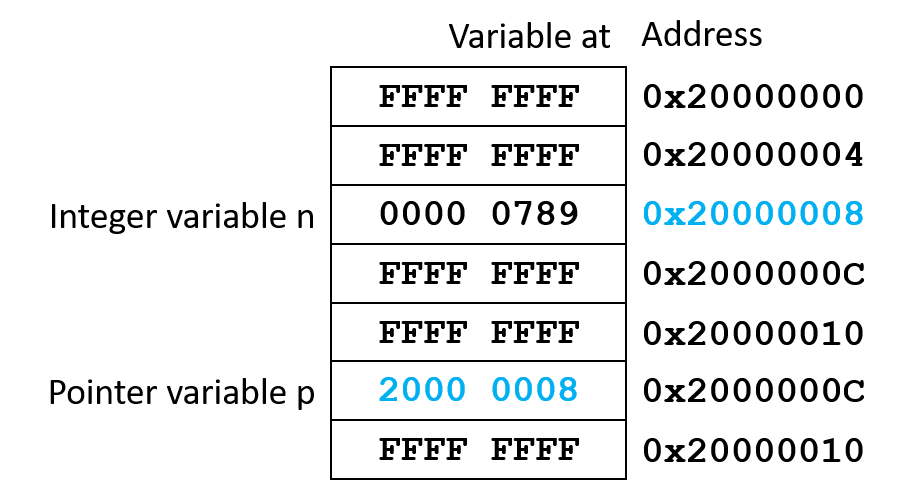


As any other variable, you need to declare a pointer. Furthermore, you have to initialize a pointer before you can use it.

Where are pointers used?

Pointers provide a method to pass more than one piece of
information into and out of a function (remember that a function can only return one value). They also provide means to pass arguments by reference to functions, rather than by value. And finally, pointers are more efficient when accessing arrays and dealing with strings.

## Pointer declaration

You declare a pointer just like any other variable:

**Syntax**
```c
type *name;
```

*Note*
- `type` can be any C type (such as `char`, `int`, or `float` for example).
- `name` is the name of the pointer variable.
- The `*` makes the variable a pointer.
- Pointers are usually described as "a pointer to `type`"

**Code example**
```c
int *myPointer        // declares a pointer named myPointer as an integer type

float *myOtherPointer // declares a pointer named myOtherPointer as a float type

myPointer = &myIntVar;        // assigns the memory address of myIntVar to myPointer

myOtherPointer = &myFloatVar; // assigns the memory address of myFloatVar to myOtherPointer
```

### Creating pointer types with typedef

**Syntax**
```c
typedef type *typeName;
```

*Note*
- A pointer variable can now be declared as type `typeName` which is a synonym for `type`.
- The * is no longer needed since `typeName` explicitly
identifies the variable as a pointer to `type`.

**Code example**
```c
typedef int *intPointer; // Create a pointer to int type

intPointer p;            // Create pointer to int (without *)
                         // Equivalent to int *p;
```

### Initialization

To set a pointer to point to another variable, we use the `&` operator (address of), and the pointer variable is used
without the dereference operator `*`:

`p = &n;`

This assigns the address of the variable `n` to the pointer `p` (`p` now points to `n`).

*Note*

`p` must be declared to point to the type of `n` (e.g. `int n; int *p;`).

### Usage

When accessing the variable pointed to by a pointer, we use the pointer with the dereference operator `*`:

`m = *p;`

This assigns to the variable m, the value of what p is pointing to (n from the last example). Using `*p`, is the same as using the variable it points to (e.g. n).

### In other words

**Code example**
```c
int n, *p; // Create an integer variable and a pointer to an integer variable

p = &n;    // Assign the address of n to p
*p = 3;    // Equals to n = 3;
```

In the pointer world:
- `&n` is a constant pointer which represents the address of `n`. This address of n will never change.
- `p` is a variable pointer to int which can be assigned the address of any int any time.
- `*p` represents the data pointed to by `p` and may be used anywhere you would use `n`.
- `*` is the dereference operator, also called the indirection operator.
- When declaring a pointer, `*` is used to indicate that the variable is a pointer rather than an ordinary variable.

### Pointers at work

Consider the following code example. How is this working in an actual design?

**Code example**
```c
int n, m;    // create two integer variables
int *p;      // create a pointer to an integer variable

 n = 0x1234; // assign 0x1234 to n
 m = 0xABCD; // assign 0xABCD to m
 p = &n;     // assign the address of n to p
*p = 0x4321; // assign 0x4321 to n using *p
 p = &m;     // assign the address of m to p
*p = 0xDCBA; // assign 0xDCBA to m using *p
```

Zero-initialized RAM at program start: 
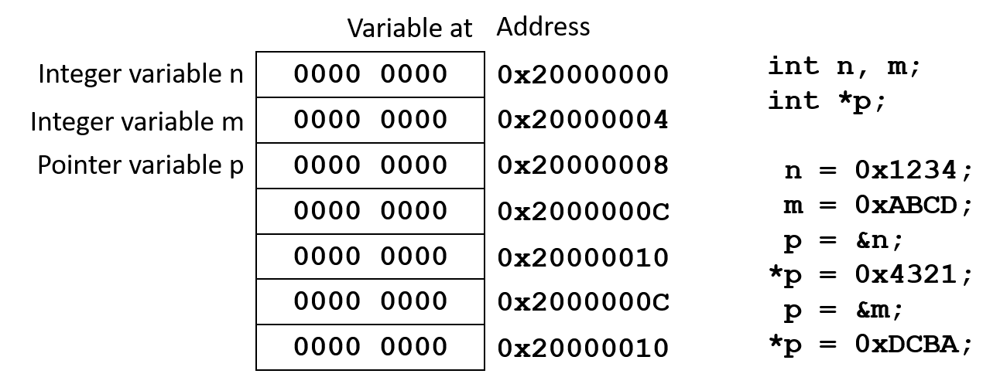

Assign 0x1234 to n:
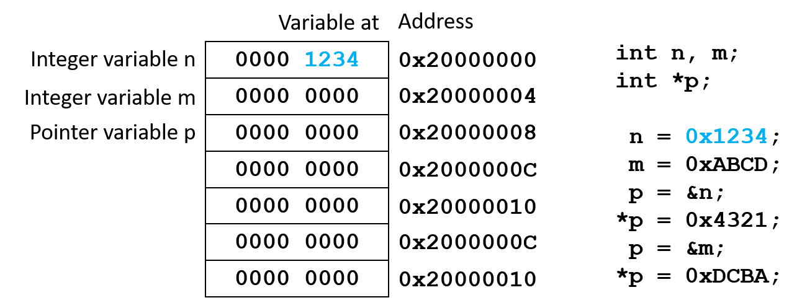

Assign 0xABCD to m:
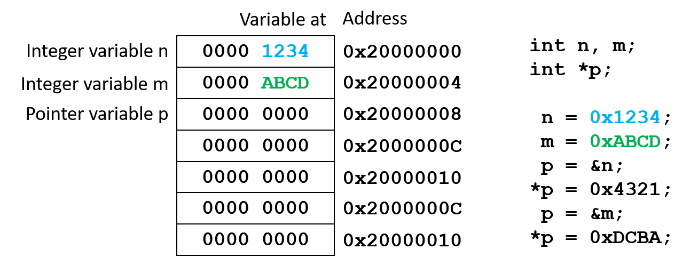

Assign the address of n to p:
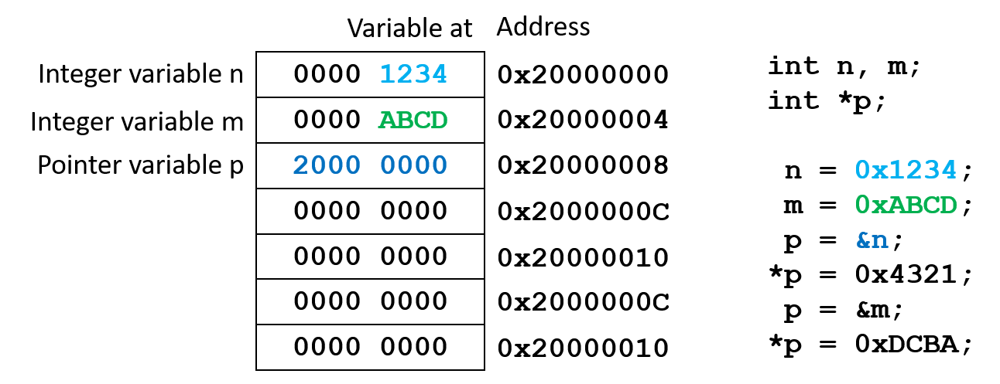

Assign 0x4321 to n using *p:
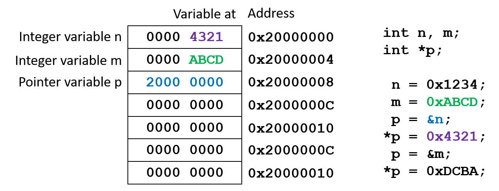

Assign the address of m to p:
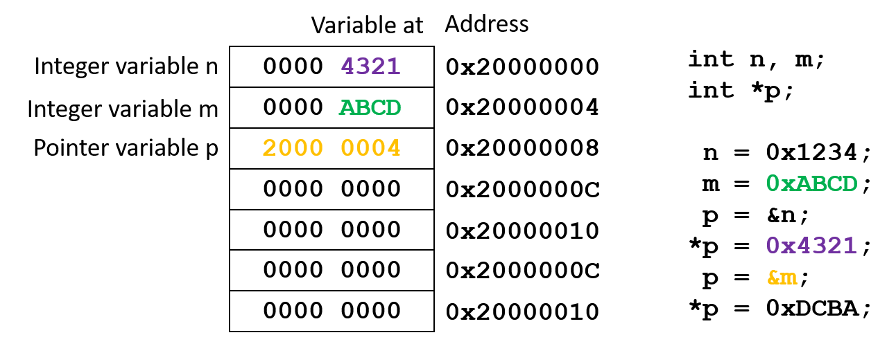

Assign 0xDCBA to m using *p:
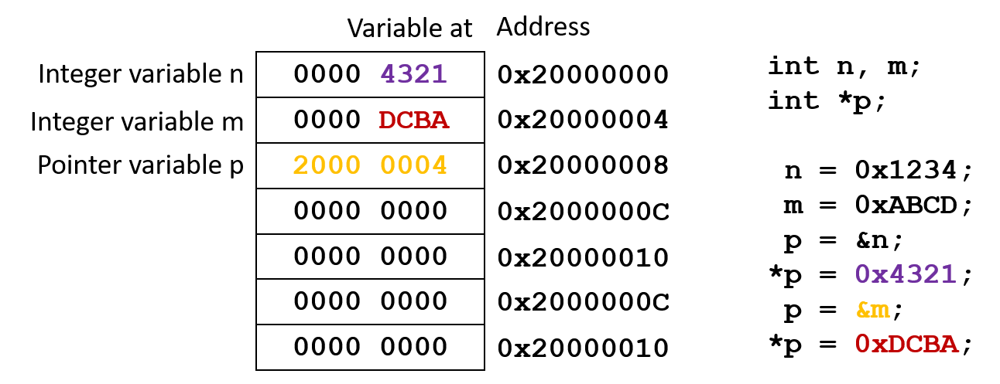

## Pointers and arrays

In general, array elements occupy consecutive locations in memory. Using this knowledge, we can use pointers to access array elements.

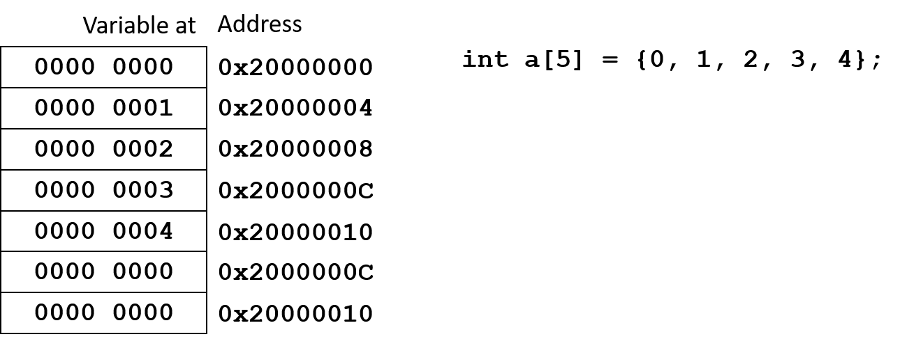

### Initializing a pointer to an array

**Code example**
```c
int a[5] = {0, 1, 2, 3, 4}; // integer array
int *p;      // Create a pointer to an integer variable
```

To initialize the pointer to the array, you can use three different (equal) methods:

**Code example**
```c
p = a;     // works only for arrays, as the array name (here: a) is the same as the address of its first element; Arm compiler will not complain
p = &a;    // works for arrays and variabls alike, but in case of an array, the Arm compiler will issue a warning
p = &a[0]; // safe way to point to the first element; compiler will not complain 
```

To move to the next element of the array, simply increment the pointer:

**Code example**
```c
p++;     // moves the pointer to the next element of the array
p--;      // moves the pointer to the previous element of the array
```

*Note*

Adding or subtracting a number to/from the pointer will change it by a multiple of the number of bytes of its type.

**Code example**

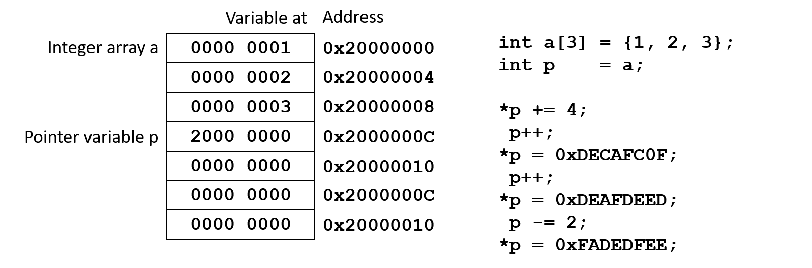

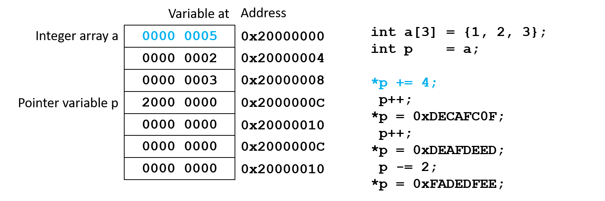

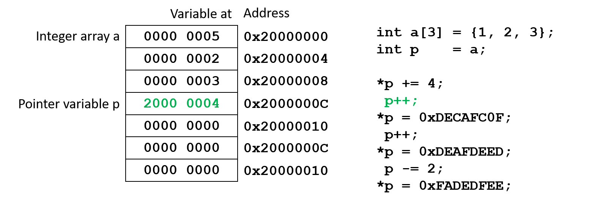

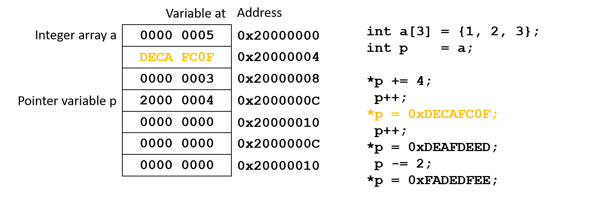

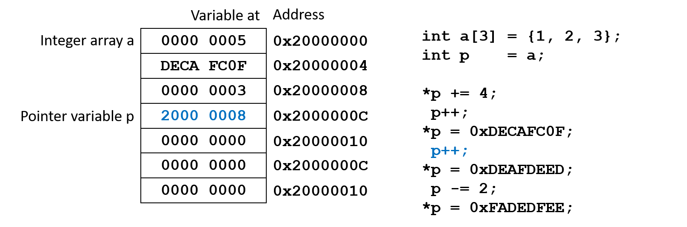

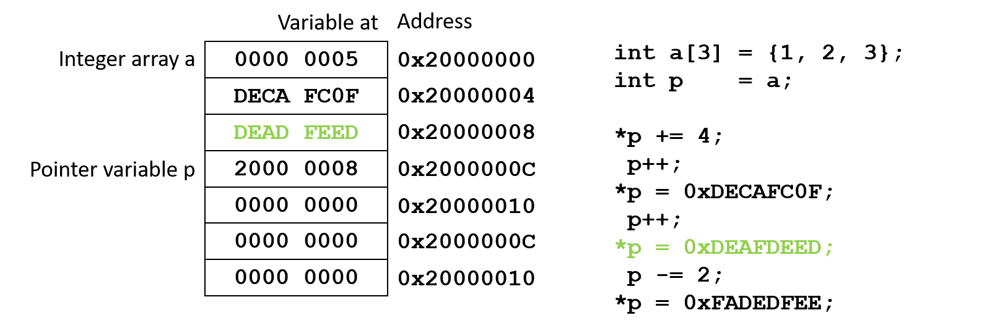

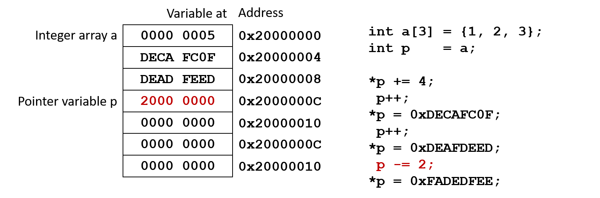

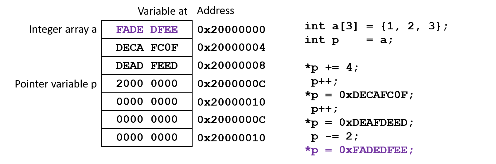


### Increment/decrement syntax rules

Use parentheses to determine what gets incremented or decremented.

**Modify the pointer itself**

```c
// Pre-increment:
*(++p);
*++p;
++p;
// usage example:
n = *(++p);
// is equivalent to:
p = p + 1;
n = *p;

// Post-increment:
*(p++);
*p++;
p++;
// usage example:
n = *p++;
// is equivalent to:
n = *p;
p = p + 1;
```

**Modify the value pointed to by the pointer**
```c
// Pre-increment:
++(*p);
// usage example:
n = ++(*p);
// is equivalent to:
*p = *p + 1;
n = *p;

// Post-increment:
(*p)++;
// usage example:
n = (*p)++;
// is equivalent to:
n = *p;
*p = *p + 1;
```

**Post-increment code example**

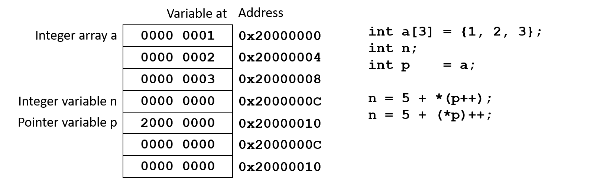

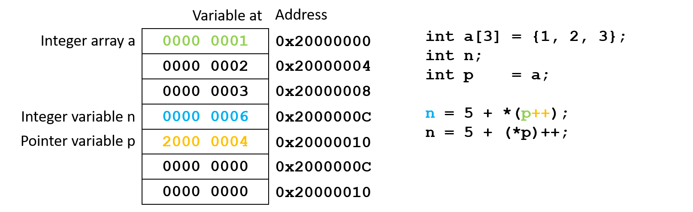

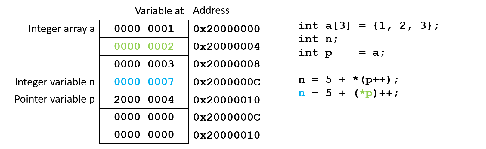

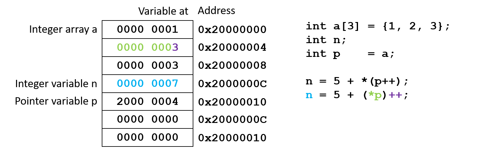

*Note*

Remember that `*(p++)` is the same as `*p++`!

**Pre-increment code example**


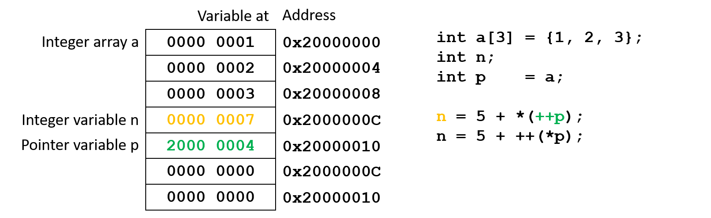

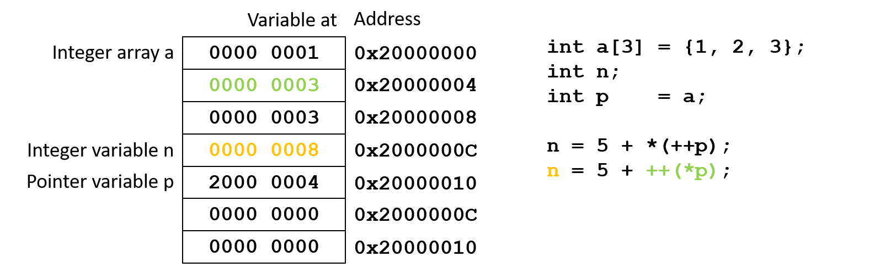

*Note*

Remember that `*(++p)` is the same as `*++p`!

## Pointers and functions

In general, functions operate on copies of the data that is passed to them. This is called pass by value. The value of the variable that is passed to a function is copied into the local variable of the function. The original variable *is not* changed.

### Passing pointers to functions

Using a pointer, a function can operate on the original value instead of a copy. This is called pass by reference.

**Code example**
```c
int n = 3;

void square (int *a) { 
    *a *= *a;
}

int main (void) {
    square(&n);
}
```

*Note*

In the example above, the address of the variable is passed to the function and stored in the local pointer variable a. After the function call, n = 9. It was changed by the function.

Functions with pointer parameters:

`int foo (*n)`

must be called in one of the following two ways.

1. `foo(&a)` which passes an address to the function so that the address may be assigned to the pointer parameter: `n = &a`.
2. `foo(p)` which passes a pointer to the function so that the pointer may be assigned to the pointer parameter `n = p`.

As addresses of parameters are copied to local pointer
variables, functions can now modify the original
variables via pointers, as shown in the next example.

**Code example**
```c
void swap_values (int *v1, int *v2) {
	int temp;
	temp = *v1;
	*v1  = *v2;
	*v2  = temp;
}

// main() function
int main(void) {
	int  n = 5, m = 10;
	int *p = &m;
	swap_values (&n, p);
  // Endless loop
	while(1);
}
```

## Pointers and strings

Until now, we have used arrays of `char` to work with strings. Using pointers, strings can be created and used in a more efficient way.

**Syntax**
```c
char *name = "string_content";
```

*Note*

- Initializing a character string when it is declared is essentially the same for both a pointer and an array
- The NULL character `\0` is automatically appended to
strings in both cases

**Code example**
```c
char *str = "Cortex";
```

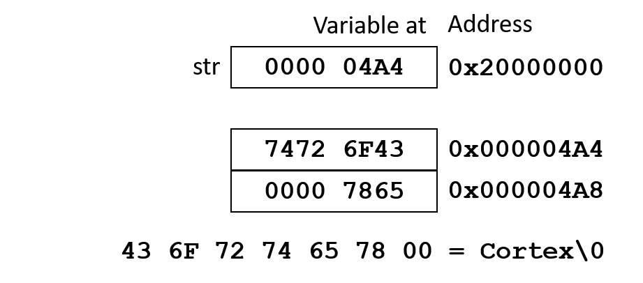

At initialization, a pointer to a string points to the first character. To access subsequent characters, add an offset to the pointer.


### Pointers versus arrays

An entire string may be assigned to a pointer in a single step, while a character array must be assigned character
by character. Also, you must explicitly add the NULL character `\0` to an array.

**Code example**
```c
// Pointer variable
char *str;
str = "Cortex";

// Array variable
char str[7];
str[0] = 'C';
str[1] = 'o';
str[2] = 'r';
str[3] = 't';
str[4] = 'e';
str[5] = 'x';
str[6] = '\0';
```

## Arrays of pointers

An array of pointers is an array variable whose elements are all be pointers.

**Code example**
```c
char *str[3]; // creates an array of three pointers to char

str[0] = "IN";
str[1] = "OUT";
str[2] = "TRISTATE";
```

The array `str[]` itself is like any other array. Each element, such as str[1], is a pointers to `char`.

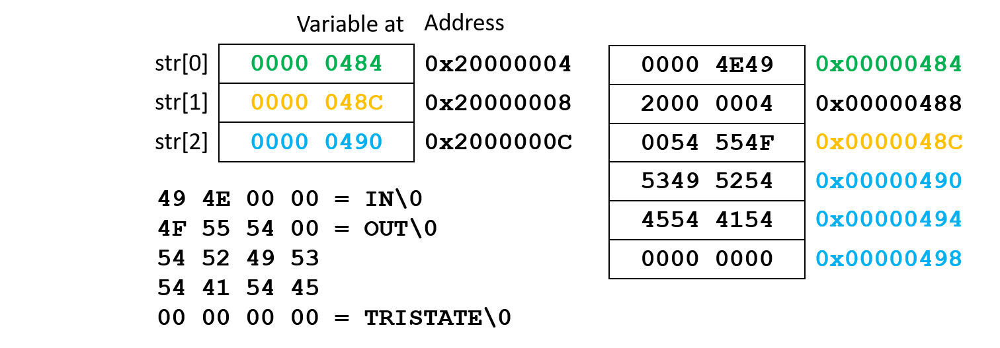

*Note*

Strings will not “pack” this nicely! There will be empty locations between strings as the compiler aligns the strings in memory.

### Initialization

A pointer array element may be initialized just like its ordinary variable counterpart.

**Code example**
```c
str[0] = &n;
```

When using strings:

**Code example**
```c
str[0] = "String";
```

### Dereferencing

To use the value pointed to by a pointer array element, just dereference it like you would an ordinary variable

**Code example**
```c
m = *str[0];
```

Using *str[0] is the same as using the object it points to, such as `n` or the string literal `"String"`.

## Summary

Pointers enable the programmer to pass a variable by reference to a function. This allows the function to modify the original variable and not just a copy of its contents.

Arrays are frequently treated like pointers. An array name alone represents the address of its first element.
