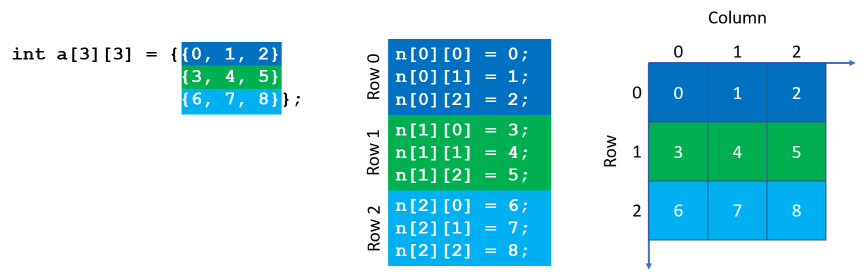

# Preface

This reference manual is intended to help programmers of Arm Cortex-M based microcontrollers to master their devices. It is a reference for the C language, the most widely used language for embedded microcontrollers.

This reference manual explains the underlying concepts of the C language and shows the Arm related specifics. For example, being a 32-bit architecture, access to memory is different than for the good old 8051.

The labs are using [Arm Keil MDK](https://www2.keil.com/mdk5), the integrated development environment (IDE) from Arm for microcontrollers. The free MDK-Lite edition is sufficient to follow the examples that are part of this manual. To download and install the tool, just follow the [instructions on keil.com](http://www2.keil.com/mdk5/install/). For most labs, no access to hardware is required, as the labs run in the µVision simulator. For working with real hardware, there is plenty of third party material available, just take a look at the link list at the end of the manual.

I hope that you find this reference manual useful in your daily work. Happy coding!


# Comments

What is a comment?

> Comments are used to document a program's functionality. They explain what a particular block or line of code does. Comments are always ignored by the compiler.

There are two kinds of comments:

### Block comment
```c
/* This is a block comment. */
```

- Block comments begin with `/*` and end with `*/`
- They can span multiple lines

**Code example**
```c
/*-----------------------------------------------
 * CMSIS-RTOS 'main' function template
 *---------------------------------------------*/

#include "cmsis_os2.h"

/*
 * main: initialize and start the system
 */
int main (void) {
  osKernelInitialize (); /* initialize RTOS */
  
  LED_Initialize();      /* initialize LEDs */
  /* create 'thread' functions that
     start executing. Example:
     tid_name=osThreadCreate (osThread(name), NULL);
  */

  osKernelStart (); /* start thread execution */
}
```

### Single line comment
 ```c
// This is a single line comment.
```

- Single line comments begin with `//` and run until the end of the current line 
- They can *not* span multiple lines

**Code example**
```c
//-----------------------------------------------
// CMSIS-RTOS 'main' function template
//-----------------------------------------------

#include "cmsis_os2.h"

// main: initialize and start the system

int main (void) {
  osKernelInitialize (); // initialize RTOS
  
  LED_Initialize();      // initialize LEDs
  // create 'thread' functions that start executing
  // Example:
  // tid_name=osThreadCreate (osThread(name), NULL);

  osKernelStart (); // start thread execution
}
```

### Nesting comments

- Block comments must not be nested within other comments
- Single line comments may be nested

**Code example**
```c
/*-----------------------------------------------
 * CMSIS-RTOS 'main' function template
 * // comment within a comment
 *---------------------------------------------*/

#include "cmsis_os2.h"

/*
 * main: initialize and start the system
 */
int main (void) {
  osKernelInitialize (); /* initialize RTOS */
  
  LED_Initialize();      /* initialize LEDs */
  /* create 'thread' functions that start
     executing,
     /* another comment which doesn't work  */
     example:
     tid_name=osThreadCreate (osThread(name), NULL);
  */

  osKernelStart (); /* start thread execution */
}
```


# Variables, identifiers and data types

What is a variable?

> A variable is a name that represents one or more memory locations used to hold program data.

A variable is a kind of bucket that you can use to hold program data.

**Code example**
```c
int myVar;
myVar = 42;
```

- Variable declarations consist of a **data type** and a unique **identifier (name)**

```c
int   myVar;
char  myLetter;
float myFLoat,
```

- The data type determines the size of the memory location that is used to store the variable and determines how the value of the variable is interpreted.

## Identifiers

What are identifiers?

> Identifiers are names that are given to program elements, such as variables, functions, arrays, or any other named element.

- Valid characters in identifiers are '_', 'a' to 'z', 'A' to 'Z', and '0' to '9' (not allowed for the first character).
- Identifiers are case sensitive, so `myVar` is not the same as `myvar`!
- You *must not use* keywords of the C language as identifiers.
- The Arm compiler provides additional keywords that are extensions to the C/C++ standards and *must also not be used* as identifiers.

### ANSI C keywords

| | | | | |
|---|---|---|---|---|
| auto | break | case | char | const |
| continue | default | do | double | else |
| enum | extern | float | for | goto |
| if | int | long | register | return |
| short | signed | sizeof | static | struct |
| switch | typedef | union | unsigned | void |
| volatile | while ||||

### Arm compiler 5 keywords and operators

| | | |
|---|---|---|
| __align | __int64 | __svc |
| \_\_ALIGNOF\_\_ | \_\_INTADDR\_\_ | __svc_indirect |
| __asm | __irq | __svc_indirect_r7 |
| __declspec | __packed | __value_in_regs |
| __forceinline | __pure | __weak |
| __global_reg | __softfp | __writeonly |
| __inline | __smc ||

### Arm compiler 6 (armclang) keywords and operators

| | | | |
|---|---|---|---|
| \_\_alignof\_\_ | \_\_asm | \_\_declspec | \_\_inline |

## Data types

C provides various data types. Normally, you would use:
- `int` for most variables and things that you can count, such as loop counts, events, and apples
- `char` for characters and strings
- `float` for measurable things that require decimal numbers, such as distance, temperature, or voltage
- `uint32_t` for bit manipulations, especially on 32-bit registers
- The appropriate `<stdint.h>`/`<arm_math.h>` types for storing and working with data explicitly meeting your needs (for example if you require that an integer has exactly N bits)

### Size and alignment of basic data types in Arm C/C++

ANSI C Type        | <stdint.h> C Type  | Size in bits | Natural alignment in bytes | Range of values
|------------------|------------------------|:------------:|:--------------------------:|:---------------|
char               | uint8_t                | 8            | 1 (byte-aligned)           | 0 to 255 (unsigned) by default.
signed char        |  int8_t                | 8            | 1 (byte-aligned)           | -128 to 127
unsigned char      | uint8_t                | 8            | 1 (byte-aligned)           | 0 to 255
signed short       |  int16_t               | 16           | 2 (halfword-aligned)       | -32,768 to 32,767
unsigned short     | uint16_t               | 16           | 2 (halfword-aligned)       | 0 to 65,535
signed int         |  int32_t               | 32           | 4 (word-aligned)           | -2,147,483,648 to 2,147,483,647
unsigned int       | uint32_t               | 32           | 4 (word-aligned)           | 0 to 4,294,967,295
signed long        |                        | 32           | 4 (word-aligned)           | -2,147,483,648 to 2,147,483,647
unsigned long      |                        | 32           | 4 (word-aligned)           | 0 to 4,294,967,295
signed long long   |  int64_t               | 64           | 8 (doubleword-aligned)     | -9,223,372,036,854,775,808 to 9,223,372,036,854,775,807
unsigned long long | uint64_t               | 64           | 8 (doubleword-aligned)     | 0 to 18,446,744,073,709,551,615
float              | float32_t <arm_math.h> | 32           | 4 (word-aligned)           | 1.175494351e-38 to 3.40282347e+38 (normalized values)
double             | float64_t <arm_math.h> | 64           | 8 (doubleword-aligned)     | 2.22507385850720138e-308 to 1.79769313486231571e+308 (normalized values)
long double        | float64_t <arm_math.h> | 64           | 8 (doubleword-aligned)     | 2.22507385850720138e-308 to 1.79769313486231571e+308 (normalized values)
All pointers       |                        | 32           | 4 (word-aligned)           | Not applicable.
bool (C++ only)    |                        | 8            | 1 (byte-aligned)           | false or true
\_Bool (C only)    |                        | 8            | 1 (byte-aligned)           | false or true

*Notes*
- Integers are represented in [two's complement](https://en.wikipedia.org/wiki/Two%27s_complement "Two´s complement on Wikipedia") form.
- Floating-point quantities are stored in [IEEE format](https://en.wikipedia.org/wiki/IEEE_754 "IEEE 754 on Wikipedia").

### How to declare a variable

```c
type identifier1, identifier2, ..., identifiern;
```

- Variables must be declared before they can be used
- The type is important! It tells the compiler how much memory space to allocate and how handle the values

```c
char   myFirstLetter;
int    a, b, c;
float  currentSpeed;
double sensorValue;
```

There are multiple ways to declare a variable:

**Declaration on a single line**
```c
type name;
```

**Declaration on a single line with an initial value**
```c
type name = initialValue;
```

**Multiple declarations of the same type on a single line**
```c
type name1, name2, name3;
```

**Multiple declarations of the same type on a single line with initial values**
```c
type name1 = value1, name2 = value2, name3;
```

**Code example**
```c
unsigned int myVar;
signed int   answer = 42;
char         myFirstLetter = 'a', mySecondLetter, myLastLetter = 'z';
float        hugeNumber = 5.12e+21
```

## Using typedefs
**Syntax**
```c
typedef type typeName;
```

- Typedefs are an alternative way to name types and create an alias name for the type.
- The *typeName* is now the same as the type

**Code example**
```c
typedef unsigned int uint32_t;

uint32_t a, b;    // alias for unsigned int a, b;
```

### Declaring variables

*Header* files are used to declare variables and other program elements in a separate file. Usually, header files have the filename extension *.h*. To use a header file in your C code, associate it with the `#include` directive.

The `#include` directive can be used in three different ways. You can:

1. Look for a header file in the compiler include path, which contains the compiler's directory and all of its sub-directories:
```c
#include <stdio.h>
```
2. Look for a file in the project directory:
```c
#include "myHeader.h"
```
3. Look for a file using an absolute or relative path:
```c
#include "..\..\myHeader2.h"
#include "C:\projects\myProject\inc\myHeader3.h"
```

**Code example**

main.h header file:
```c
int   n, m, p;
float myFloat;
```

main.c source file:
```c
#include "main.h"

int main (void) {
    n = 3;
    m = 1;
    p = n - m;
    myFLoat = 1 / p;
}
```
Using the `#include` directive, the contents of the main.h header file are pasted into the main.c source file, starting at the `#include` directive’s line.

After the preprocessor runs, the compiler sees the main.c source file as follows:
```c
int n, m, p;
float myFloat;

int main (void) {
    n = 3;
    m = 1;
    p = n - m;
    myFloat = 1 / p;
}
```


# Constants and literals

What are constants and literals?

> A literal is a notation for representing a fixed value in source code. A constant is a value that cannot be altered by the program during normal execution.

In other words: a literal is the actual value (such as a number or character for example), that is assigned to a variable or constant. You can also use literals directly as a function parameter or as an operand in an expression.
While both terms are often used interchangeably, they are not the same. A literal is a constant, but a constant is not a literal.

Constants, as the name implies, never change their value which makes development changes easy and eliminates the use of "magic numbers".

### How to declare a constant

There are two ways to declare a constant:

```c
#define identifierName value
const type identifierName value;
```
- The `identifierName` is the constant, while the `value` is the literal.
- The first way is very efficient for an embedded system, as it does not consume any memory in the microcontroller. Using the `#define`, you declare a text substitution label, which means that each instance of `identifierName` will be replaced with value by the preprocessor unless `identifierName` is inside a string.
- A `#define` is *never* terminated with a `';'`, unless you want that semicolon to be part of the substitution.
- The second way allocates a variable in program memory, but it cannot be changed due to the `const` keyword. While this is inefficient for normal constants, it is a good way to save lookup tables in Flash memory for example.

## Types of literals

The Arm assembler user's guide states that "source code can contain numeric, string, Boolean, and single character literals".

Literals can be expressed as:
- Decimal numbers, for example `123`.
- Hexadecimal numbers, for example `0x7B`.
- Numbers in any base from 2 to 9, for example `5_204` is a number in base 5.
- Floating point numbers, for example `123.4`.
- Boolean values `{TRUE}` or `{FALSE}`.
- Single character values enclosed by single quotes, for example `'w'`.
- Strings enclosed in double quotes, for example `"This is a string"`.

### String literals

C does not have a string type. One way to store strings in C is to use arrays of characters. Later, we will learn how to use pointers to define strings.

When strings are declared as character arrays, they are stored like other types of arrays in C. If you declare the string without a dimension, the null character is automatically appended to the end of the string:

**Code example**
```c
char name[] = "Cortex";
```

This is stored as:
```c
name[0] = 'C'
name[1] = 'o'
name[2] = 'r'
name[3] = 't'
name[4] = 'e'
name[5] = 'x'
name[6] = '\0'
```

**Special characters in strings**

Use escape sequences to include special characters in strings, just like any other ordinary character. The backslash `'\'` plus the following character is considered as a single character with a single ASCII value.

**Code example**
```c
char salutation[] = "Dear Paul,\n";
```

In order to nest strings, you need to escape the double quotes:

```c
"printf (\"hello world!\n\")"
```


# The printf() C library function

One of the most commonly used C library function is the `printf()` function which allows to write text to the "standard output" (normally a monitor or line printer). In embedded systems, often a UART is used. In Arm Cortex-M based systems you can redirect the standard output to the ITM debug channel which saves resources (the UART) and is much faster. In µVision, you can use the ["Debug printf() Viewer"](https://www.keil.com/support/man/docs/uv4/uv4_db_dbg_printf_viewer.htm) window to observe `printf()` messages delivered via ITM.

Using the Arm C complier, it is mandatory to link your application with the standard C library, even you do not directly use C library functions. This is because the compiler might implicitly generate calls to C library functions.
The standard C library consists of:
- All functions defined by the ISO C99 library standard.
- Target-dependent functions that implement the C library functions in the semihosted execution environment. You can redefine these functions in your own application.
- Functions called implicitly by the compiler.
- Arm extensions that are not defined by the ISO C library standard, but are included in the library.

### How to use printf()

```c
printf(ControlString, arg1, ..., argn);
```
Everything within the `ControlString` is printed verbatim except `%d`'s
which are replaced by the argument values from the list.

**Code example**
```c
int n = 1, m = 7;
printf("n = %d\nm = %d\n", n, m);
```
The output is:
```c
n = 1
m = 7
```
*Note*
The character `%d` is the *conversion character*.

### Conversion characters for the ControlString

| Conversion character | Description |
|---:|---|
| %c | Single character
| %s | String (all characters until `\0`)
| %d | Signed decimal integer
| %# | A `0x` should precede a hexadecimal number
| %u | Unsigned decimal integer
| %x | Unsigned hexadecimal integer with lowercase digits (`1a4e`)
| %X | As x, but with uppercase digits (`1A4E`)
| %f | Signed decimal value (floating point)
| %e | Signed decimal with exponent (`1.13e-4`)
| %E | As e, but uses E for exponent (`1.13E-4`)
| %g | As e or f, but depends on size and precision of value
| %G | As g, but uses E for exponent


# Operators

What is an operator?

> An arithmetic expression contains one or more operands and arithmetic operators.

Operands may be variables, constants or functions that return a value.

## Arithmetic operators

Arithmetic operators are used to perform arithmetic/mathematical operations on operands. Arithmetic operators are of two distinct types: 
- Binary Operators work on two operands: +, -, *, /, %
- Unary Operators work on a single operand: +, -, ++, --

| Operator | Operation | Example | Result |
|:----------:|-----------|:---------:|--------|
| * | Multiplication | `a * b` | Product of `a` and `b` |
| / | Division | `a / b` | Quotient of `a` and `b` |
| % | Modulo | `a % b` | Remainder of `a` divided by `b` |
| + | Addition | `a + b` | Sum of `a` and `b` |
| - | Subtraction | `a - b` | Difference of `a` and `b` |
| - | (unary) Negative | `-a` | Negative value of `a`|
| + | (unary) Positive | `+a` | Value of `a` |

### Division operator

If both operands are of an integer type, the result will be an integer type as well (valid for `int` and `char`).

If one or both of the operands is a floating point type, the result will be a floating point type (`float`, `double`).

### Implicit type conversion

When an expression is used in the context where a value of a different type is expected, conversion may occur. In such cases, the type of one operand will be temporarily "promoted" to the larger type of the other operand. This means that during an operation, the smaller data type will be promoted to the largest one in the expression.

**Code examples**
```c
short n = -5;
-n      // promotion to int; result is 5
n * -3L // promotion to long, because -3L is a long; result is 15
7 / n   // promotion to int; result is -1
9 % n   // promotion to int; result is 4
8.0 / n // promotion to double, because 8.0 is a double; result is -1.6
```

### Increment and decrement

Increment/decrement operators are unary operators that increment/decrement the value of a given variable by 1.

| Operator | Operation | Example | Result |
|:----------:|-----------|:---------:|--------|
| ++ | Increment | `a++` | Postfix form: use `a` and then add `1` |
|  |  | `++a` | Prefix form: add `1` to `a` and then use `a` |
| -- | Decrement | `a--` | Postfix form: use `a` and then subtract `1` |
|  |  | `--a` | Prefix form: subtract `1` from `a` and then use `a` |

**Code example**
```c
int n, m;
n = 3;

// Postfix example
m = (n++) + 8;  // Result: n = 4, m = 11

// Prefix example
m = (++n) + 8;  // Result: n = 4, m = 12
```

## Assignment operators

Assignment operators are binary operators that modify the variable to their left using the value to their right, or in other words, they assign a value to a variable.

There are two types of assignment operators available:

### Simple assignments

`variable = expression`

The expression is evaluated and the result is assigned to the variable.

### Compound assignments

`variable = variable operator expression`

The variable is modified using the operator and the expression and the result is assigned to the variable.

| Operator  | Example   | Equivalent |
|:---------:|:---------:|--------|
|`=`        | `a = b`   | Assign the value of `b` to `a`
|`+=`       | `a += b`  | `a = a + b`
|`-=`       | `a -= b`  | `a = a - b`
|`*=`       | `a *= b`  | `a = a * b`
|`/=`       | `a /= b`  | `a = a / b`
|`%=`       | `a %= b`  | `a = a % b`
|`&=`       | `a &= b`  | `a = a & b`
|`\|=`      | `a \|= b` | `a = a \| b`
|`^=`       | `a ^= b`  | `a = a ^ b`
|`<<=`      | `a <<= b` | `a = a << b`
|`>>=`      | `a >>= b` | `a = a >> b`

## Relational (comparison) operators

Relational operators are binary operators that test a condition and return `1` if that condition is logically `true` and `0` if that condition is `false`. 

| Operator | Operation                | Example  | Result (FALSE = 0, TRUE = 1) |
|:--------:|:-------------------------|:--------:|------------------------------|
| `==`     | Equal to                 | `a == b` | `1` if `a` equal to `b`, else `0` |
| `!=`     | Not equal to             | `a != b` | `1` if `a` not equal to `b`, else `0` |
| `>`      | Greater than             | `a > b`  | `1` if `a` greater than `b`, else `0` |
| `>=`     | Greater than or equal to | `a >= b` | `1` if `a` greater than or equal to `b`, else `0` |
| `<`      | Less than                | `a < b`  | `1` if `a` less than `b`, else `0` |
| `<=`     | Less than or equal to    | `a <= b` | `1` if `a` less than or equal to `b`, else `0` |

*Note*

Do not interchange `=` with `==`. `=` is the assignment operator, while `==` is the "equals to" relational operator.

**Code example**
```c
int n, m;

n = 3;         // assign the value 3 to a

if (m == 45) { // check if m equals to 45
    // do something here
}
```

## Logical operators

Logical operators apply standard *boolean algebra* operations to their operands.

| Operator | Operation   | Example  | Result |
|:--------:|:------------|:--------:|--------|
| `!`      | Logical NOT | `!a`     | `1` if `a = 0`, else `0`
| `&&`     | Logical AND | `a && b` | `1` if both `a ≠ 0` and `b ≠ 0`, else `0`
| `||`     | Logical OR  | `a || b` | `0` if both `a = 0` and `b = 0`, else `1`

## Bitwise operators

Bitwise operators apply the operation to each bit of the first operand with each corresponding bit of the second operand.

| Operator | Operation           | Example  | Result |
|:--------:|:--------------------|:--------:|--------|
| `~`      | Bitwise NOT         | `~a`     | `1`, if `0` in `a`; `0`, if `1` in `a`
| `&`      | Bitwise AND         | `a & b`  | `1`, if `1` in both `a` and `b`; `0`, if `0` in `a` or `b` or both
| `|`      | Bitwise OR          | `a | b`  | `1`, if `1` in `a` or `b` or both; `0`, if `0` in both `a` and `b`
| `^`      | Bitwise XOR         | `a ^ b`  | `1`, if `1` in `a` or `b` but not both; `0`, if `0` or `1` in both `a` and `b`

*Note*

- The bitwise NOT is also known as "One's complement".
- Do not interchange `&` with `&&`. `&` is the bitwise AND operator, while `&&` is the logical AND operator.

**Code example**
```c
int n, m;

if (n && m) { // check if both values are true (non-zero)
    // do something here
}
```

## Shift operators

| Operator | Operation           | Example  | Result |
|:--------:|:--------------------|:--------:|--------|
| `<<`     | Bitwise left shift  | `a << b` | Shift `a` by `b` bits to the left
| `>>`     | Bitwise right shift | `a >> b` | Shift `a` by `b` bits to the right

*Note*

- Bits that are shifted out are lost (in both cases)
- For shift left, 0's are shifted in (zero fill)

**Code example**
```c
// Logical shift right (zero fill)
// If a is unsigned:
unsigned char a;
a = 250;    // a = 0b11111010 = 250
b = a >> 2; // b = 0b00111110 = 62

// Arithmetic shift right (sign extend)
// If a is signed:
char a;
a = -6;     // a = 0b11111010 = -6
b = a >> 2; // b = 0b11111110 = -2
```

### Power of 2 integer divide vs. shift right

Generally, it is more efficient to use a shift right instead of dividing by a power of 2. This means that `b = a / 2^n` is equal to `b = a >> n`. This trick works for integer and fixed point values.

## Memory addressing/member access

Member access operators allow access to the members of their operands.

| Operator | Operation                     | Example  | Result |
|:--------:|:------------------------------|:--------:|--------|
| `[]`     | Array subscript               | `a[b]`   | access the `b`th element of array `a`
| `*`      | Pointer dereference           | `*a`     | The object or function `a` points to
| `&`      | Address of                    | `&a`     | Pointer to `a`
| `.`      | Member access (struct/union)  | `a.b`    | The member `b` of struct or union `a`
| `->`     | Member access through pointer | `a->b`   | The member `b` of struct or union pointed to by `a`

*Note*

This will become important when talking about arrays, pointers, structs, and unions later.

## Other operators

| Operator | Operation            | Example     | Result |
|:--------:|:---------------------|:-----------:|--------|
| `(...)`  | Function call        | `f(...)`    | Calls the function f(), with specified arguments
| `,`      | Comma operator       | `a, b`      | Evaluates `a` then `b`, else result is value of `b`
| `(type)` | Type cast            | `(type)a`   | Casts the type of `a` to type
| `? :`    | Conditional operator | `a ? b : c` | The value of `b` if `a` is true, else value of `c`
| `sizeof` | Sizeof operator      | `sizeof a`  | The size in bytes of `a`

### The conditional operator

`(test_expression) ? do_if_true : do_if_false;`

**Code example**
```c
int a = 3, b = 4, c;

(a % 2 != 0) ?
  printf("%d is odd\n", a) :
  printf("%d is even\n", a);

c = (a % 2 != 0) ? a : b; // conditionally assigns a value to c
```

### Explicit type cast operator

You can use the cast operator `(type)` to cast a variable:

**Code example**
```c
int a = 10;
float b;
b = (float)a / 4; // b is 2.5, because float/int = float
```

## Operator precedence

The following table lists the precedence and associativity of C operators. Operators are listed top to bottom, in descending precedence. Conflicts between operators with the same precedence are handled via the rules of associativity.

Precedence | Operator       | Description | Associativity
|:--------:|:--------------:|:-----------|--------|
|1         | `++ --`        | Suffix/postfix increment and decrement | Left-to-right
|          | `()`           | Function call| |
|          | `[]`           | Array subscripting| |
|          | `.`            | Structure and union member | |
|          | `->`           | Structure and union member access through pointer| |
|          | `(type){list}` | Compound literal(C99)| |
|2         | `++ --`        | Prefix increment and decrement | Right-to-left
|          | `+ -`          | Unary plus and minus| |
|          | `! ~`          | Logical NOT and bitwise NOT| |
|          | `(type)`       | Type cast| |
|          | `*`            | Indirection (dereference)| |
|          | `&`            | Address-of| |
|          | `sizeof`       | Size-of| |
|3         | `* / %`        | Multiplication, division, and remainder | Left-to-right
|4         | `+ -`          | Addition and subtraction| |
|5         | `<< >>`        | Bitwise left shift and right shift| |
|6         | `< <=`         | For relational operators < and ≤ respectively| |
|          | `> >=`         | For relational operators > and ≥ respectively| |
|7         | `== !=`        | For relational = and ≠ respectively| |
|8         | `&`            | Bitwise AND| |
|9         | `^`            | Bitwise XOR (exclusive or)| |
|10        | `|`            | Bitwise OR (inclusive or)| |
|11        | `&&`           | Logical AND| |
|12        | `||`           | Logical OR| |
|13        | `?:`           | Ternary conditional | Right-to-Left
|14        | `=`            | Simple assignment| |
|          | `+= -=`        | Assignment by sum and difference| |
|          | `*= /= %=`     | Assignment by product, quotient, and remainder| |
|          | `<<= >>=`      | Assignment by bitwise left shift and right shift| |
|          | `&= ^= |=`     | Assignment by bitwise AND, XOR, and OR| |
|15        | `,`            | Comma | Left-to-right 

### Precedence

When expressions contain multiple operators, their precedence determines the order of evaluation.

| Expression    | Expression with precedence |
|:-------------:|:--------------------------:|
| `a – b * c`   | `a – (b * c)`              |
| `a + ++b`     | `a + (++b)`                |
| `a + ++b * c` | `a + ((++b) * c)`          |

*Note*

If functions are part of an expression, there is no way to tell which function is evaluated first. 

### Associativity

For two operators with the same precedence, the associativity determines the order of the evaluation of the expression.

| Expression  | Associativity | Expression with precedence |
|:-----------:|:--------------|:--------------------------:|
| `x / y % z` | Left-to-Right | `(x / y) % z`              |
| `x = y = z` | Right-to-Left | `x = (y = z)`              |
| `~++x`      | Right-to-Left | `~(++x)`                   |

Although these rules are always applied, it is good practice to explicitly group the elements of an expression using `()`.


# Expressions and statements

Every C program is made using statements. The program is executed statement by statement. Every statement is made using one or more expressions. An expression is a sequence of [operators](#operators) and their operands that specifies a computation.

In other words, an expression is an instruction that is executed and returns a value (even when this value is `void`). A statement is used to form the sequence of a program (see below).

There are three kinds of statements in C:
1. [Expression statements](#expression-statements)
1. [Compound statements](#compound-or-block-statements)
1. [Control statements](#control-statements)

**Code example**

```c
n + m
a = b
time = dist/speed
x = ReadIO()
f <= 2
y == 42
count++
c = b + 3
```

## Expression statements

An expression statement is an expression followed by a semicolon (`;`). The execution of the statements causes the expression to be evaluated.

**Code example**
```c
a = 0;
a++;
b = 3 + c;
y = (a * x) + b;
printf("Speed = %f", x);
; // the semicolon itself is an expression
```

## Compound or block statements

A compound statement is a group of statements enclosed within a pair of curly braces (`{ }`) and is often also called a block statement. The statements within the block may be of any statement type (including (again) compound statements). This allows statements to be embedded or nested within other statements. A compound statement **does not** end with a semicolon after the closing `}`.

**Code example**
```c
{
  a = 0;
  a++;
  b = 3 + c;
  y = (a * x) + b;
  printf("Speed = %f", x);
}
```

## Control statements

Control statments are used for loops, branches and logical tests and often require other statements to be embedded within them. We will take a closer look at them in the chapter [Decision making](#decision-making).

**Code example**
```c
while (1) {
    // do something here
}
```

# Decision making

## Boolean expressions

C (unlike C++) does not have a boolean data type. As shown in the table in chapter [Data types](#data-types), you can use `_Bool` for that. But the usual convention is that any boolean expression returns integer values:
- `0` if an expression evaluates as `FALSE`
- non-zero if it evaluates as `TRUE` (usually `1`, but this is not guaranteed)

**Code example**
```c
int main (void) {
    int a = 3, b, c;
    c = (a > 2); // c = 1 (TRUE)
    b = (a < 1); // b = 0 (FALSE)
}
```

### Express it differently

Expressions can be written in different ways which all lead to the same result (are evaluated similarly). Laziness drives programmers to usually use the first method of the following example:

**Code example**
```c
#define BUTTONPRESSED 1

int main (void) {
    if (BUTTONPRESSED)
      // do something
    if (BUTTONPRESSED != 0)
      // do something else
}
```

## `if` statement

**Syntax**
```c
if (expression) statement
```

The expression is evaluated in a boolean fashion. If it is true, the statement is executed.

*Note*

The `statement` can also be a compound/block statement.

**Code example**
```c
#define BUTTONPRESSED 1

int main (void) {
    if (BUTTONPRESSED) {
        printf("Button is pressed\n");
    }
}
```

### `if (a)` vs. `if (a == 1)`

Not only laziness commands the usage of `if (a)`. This C code will also lead to reduced assembly code size, as it only has to test for not being equal to `0`:

```
0x00001170 4807      LDR      r0,[pc,#28]  ; @0x00001190
0x00001172 6800      LDR      r0,[r0,#0x00]
0x00001174 B110      CBZ      r0,0x0000117C
```

`if (a == 1)` creates more assembly code, as it has to explicitly check the equality with `1`:

```
0x0000117C 4808      LDR      r0,[pc,#32]  ; @0x000011A0
0x0000117E 6800      LDR      r0,[r0,#0x00]
0x00001180 2801      CMP      r0,#0x01
0x00001182 D102      BNE      0x0000118A
```

*Note*

- `CBZ` is the "compare and branch on zero" instruction that will only branch if the comparison with `0` is TRUE.
- There is no "compare and branch on one" instruction, so you have to compare first (`CMP`) and then branch (`BNE`) if the result is not equal one.

### Nesting `if` statements

You can nest `if` statements easily.

**Code example**
```c
#define BUTTONPRESSED 1
float adc_input;

int main (void) {
    if (BUTTONPRESSED) {
        printf("Button is pressed\n");
        } if (adc_input >= 2.3) {
            printf("Input is larger than 2.3\n");
            }
}
```

### `if else` statement

**Syntax**
```c
if (expression) statement1
else statement2
```

The expression is evaluated in a boolean fashion. If it is true, statement1 is executed, if false, statement2 is executed.

**Code example**
```c
#define BUTTONPRESSED 1

int main (void) {
    if (BUTTONPRESSED) {
        printf("Button is pressed\n");
        } else {
            printf("Button is not pressed!\n");
            }
}
```

### `if else if` statement

**Syntax**
```c
if (expression1) statement1
else if (expression2) statement2
else statement3
```

The expression1 is evaluated in a boolean fashion. If it is true, statement1 is executed, if false, expression2 is evaluated. If it is true, statement2 is executed, if false, statement3 is executed.

**Code example**
```c
float adc_input;

int main (void) {
    if ((adc_input > 0) && (adc_input <= 1.0)) {
        printf("Input below 1 V!\n");
    } else if { ((adc_input > 1.0) && (adc_input <= 2.0))
        printf("Input above 1 V and below 2 V!\n");
    } else if { ((adc_input > 2.0) && (adc_input <= 3.0))
        printf("Input above 2 V and below 3 V!\n");
    } else {
        printf("Incorrect input voltage!");
    }
}
```

## `switch` statement

**Syntax**
```c
switch (expression) {
    case const-expr1: statements1
    :
    case const-exprn: statementsn
    default: statementsn+1
}
```

The expression is evaluated and tested for a match with the const-expr in each case clause. The statement(s) in the matching case clause is/are executed.


*Note*

- Each statement falls through to the next statement. This is the default behavior of the switch statement.
- Adding a `break` statement to each statement block will eliminate fall through, allowing only one case clause's statement block to be executed.

**Code example**
```c
switch (number) {
    case 0:  printf("Zero selected\n");  break;
    case 1:  printf("One selected\n");   break;
    case 2:  printf("Two selected\n");   break;
    case 3:  printf("Three selected\n"); break;
    case 4:  printf("Four selected\n");  break;
    case 5:  printf("Five selected\n");  break;
    case 6:  printf("Six selected\n");   break;
    case 7:  printf("Seven selected\n"); break;
    case 8:  printf("Eight selected\n"); break;
    case 9:  printf("Nine selected\n");  break;
    default: printf("No number selected\n");
}
```


# Loops

The C language provides three basic looping structures:
- [`for` loop](#for-loop): checks the loop condition at the top and automatically executes the iterator at the bottom of the loop.
- [`while` loop](#while-loop): checks the loop condition at the top; you must create the iterator if needed.
- [`do-while` loop](#do-while-loop): checks the loop condition at the bottom; you must create the iterator if needed.

## `for` loop

**Syntax**
```c
for (expression1; expression2; expression 3)
    statement
```

The expression1 initializes the loop count variable once (e.g. n= 0). The expression2 is the test condition. The loop will continue while this is true
(e.g. n <= 10). The expression3 is executed at the end of each iteration; usually to modify the loop count variable (e.g. n++).

*Note*

- Any or all of the three expressions may be left blank (semicolons must remain)
- If expression1 or expression3 are missing, their actions simply disappear
- If expression2 is missing, it is assumed to always be true

**Code example**
```c
int n;

for (n = 0; n < 5; n++ ) {
    printf("Loop iteration %d\n", n);
}
```

**Output**
```
Loop iteration 0
Loop iteration 1
Loop iteration 2
Loop iteration 3
Loop iteration 4
```

### Infinite for loops

A `for` loop without any expressions will execute indefinitely. You can only leave the loop using the `break` statement.

**Code example**
```c
for (;;) {
    // run forever
}
```

## `while` loop

**Syntax**
```c
while (expression)
    statement
```

If the expression is true, the statement will be executed. Afterwards, the expression will be reevaluated to determine whether or not to execute the statement again. It is possible that the statement will never be 
executed if the expression is false when it is evaluated for the first time.

*Note*

- The expression must always be there, unlike with a for loop
- `while` is used more often than `for` when implementing an infinite loop, though it is only a matter of personal taste (mainly less coding effort)
- Frequently used for the main loop of a program

**Code example**
```c
int n = 0;

while (n < 5) {
    printf("Loop iteration %d\n", n++);
}
```

**Output**
```
Loop iteration 0
Loop iteration 1
Loop iteration 2
Loop iteration 3
Loop iteration 4
```

### Infinite while loops

A `while` loop with the expression = 1 will execute indefinitely. You can only leave the loop using the `break` statement.

**Code example**
```c
while (1) {
    // run forever
}
```

## `do-while` loop

**Syntax**
```c
do statement while (expression);
```

The statement is executed and then the expression is evaluated to determine
whether or not to execute the statement again. The statement will always execute at least once, even if the expression is false when the loop starts.

**Code example**
```c
int n = 0;

do { printf("Loop iteration %d\n", n); }
while (n < 5);
```

**Output**
```
Loop iteration 0
Loop iteration 1
Loop iteration 2
Loop iteration 3
Loop iteration 4
```

## `break` statement

**Syntax**
```c
break;
```

The `break` statement causes immediate termination of a loop, even if the exit condition has not been met. Also, it exits from a `switch` statement so that execution doesn't fall through to next `case` clause.

**Code example**
```c
int n = 0;

while (n < 10) {
    if (n == 5) break;
    printf("Loop iteration %d\n", n++);
}
```

**Output**
```
Loop iteration 0
Loop iteration 1
Loop iteration 2
Loop iteration 3
Loop iteration 4
```

## `continue` statement

**Syntax**
```c
continue;
```

The `continue` statement causes a program to jump back to the beginning of a loop without completing the current iteration.

**Code example**
```c
int n = 0;

while (n < 5) {
    if (n == 3) continue;
    printf("Loop iteration %d\n", n++);
}
```

**Output**
```
Loop iteration 0
Loop iteration 1
Loop iteration 2
Loop iteration 4
```


# Functions

What are functions?

> Functions are self contained program segments designed to perform a specific task. They take inputs, do some computation, and produce output. 

Functions provide a way to modularize code and make it easier to maintain. Also, functions promote code reuse.

*Notes*

- All C programs have one (at least the `main()` function is required) or more functions
- Functions can accept parameters from the code that calls them
- Functions usually return a single value
- Functions help to organize a program into logical, manageable segments

**Syntax**
```c
type identifier (type1 arg1, type2 arg2, ..., typen argn) {
    declarations        // body
    statements          // body
    return expression;  // body
}
```

Where:
- `type` is the data type of the return expression.
- `identifier` is the name of the function.
- `type1 arg1, type2 arg2, ..., typen argn` is the parameter list which is optional.
- `expression` is the (optional) return value.
- the body is also optional. 

## Return data type

- A function's `type` must match the type of data in the return `expression`
- A function may have multiple return statements (of the same type), but only one will be executed
- The function type is `void` if the `return` statement has no `expression` or is not present at all. This is also known as a procedure function, since nothing is returned.
- Functions can return any type except arrays and functions. We can get around this limitation by returning a pointer to an array or a pointer to a function.

## Parameters

- A function's parameters are declared just like ordinary variables, but in a comma separated list inside the parentheses
- The parameter names are only valid inside the function (local to the function)
- The list may mix different data types
- Parameters of the same type must be declared separately (as separation using commas will not work here)
- If no parameters are required, use the keyword `void` in place of the parameter list when defining the function

## How to call a function

**Code example**
```c
foo ();         // no parameters, no return value
x = foo ();     // no parameters, but with a return value
foo (n, m);     // with parameters, but no return value
x = foo (n, m); // with parameters and with a return value
```

## Function prototypes

Just like a variable, a function must be declared before it may be used. This declaration must occur before `main()` or any other function that uses it. The declaration may have two forms:
- The entire function definition
- Just a function prototype – the function definition itself may then be placed anywhere in the program

**Code example 1**

In this example, the function is declared *and* defined before it is used in `main()`.

```c
int n = 5, m = 10, res;
int minimum (int a, int b) {
    return ((a <= b) ? a : b);
}

int main (void) {
    res = minimum (n, m);
    printf("The minimum is %d\n", res);
}
```

**Code example 2**

In this example, the function is declared before it is used in `main()`, but only defined after it is used in `main()`.
 
```c
int n = 5, m = 10, res;
int minimum (int a, int b);

int main (void) {
    res = minimum (n, m);
    printf("The minimum is %d\n", res);
}

int minimum (int a, int b) {
    return ((a <= b) ? a : b);
}
```

### Function prototype formats

**Code example**
```c
// Function prototype 1:
int minimum (int x, int y);  // exact copy of the function header

// Function prototype 2:
int minimum (int, int);      // contains only the parameter data types
```

## Passing parameters by value

Parameters are passed to a function *by value*. These values are copied into the local parameter variables. This means, that the original variable that is passed to a function cannot be modified by the function, since only a copy of its value was passed.

**Code example**
```c
int n = 5, m = 10, res;
int minimum (int a, int b);

int main (void) {
    res = minimum (n, m);  // the value of n is copied into a
                           // the value of m is copied into b
    printf("The minimum is %d\n", res);
}

int minimum (int a, int b) {
    return ((a <= b) ? a : b);
}
```

## Functions and scope

### Scope of parameters

A function's parameters are local to the function and have no meaning outside
the function itself. Parameter names may have the same identifier as a variable declared outside the function, but the parameter names will take precedence inside the function.

**Code example**
```c
// The following n's are not the same: 
int n;
int absolute (int n);
```

### Scope of variables inside a function

Variables that are declared inside a function are local to the function itself. 

**Code example**
```c
void my_func (int n) {
    int m;
    ..
    m -= n;  // n refers to the function paramter
             // while me refers to the locally declared variable
}
```

*Note*

- Variables that are declared within a function block are not accessible outside the function.
- Any access to a local variable outside the function will generate an error.

### Global versus local variables

Global variables can be seen by everybody, while local variables can only be seen locally.

**Code example**
```c
int n = 5;              // can be seen by everybody

int foo (int m);        // foo's local paramter is m

int foo (int m) {       // foo cannot see main's local variable i
    int p = 3;          // foo's local variable is p
    return (n - m * p); // foo can see gloabal variable n
}

int main (void) {       // main cannot see foo's paramter m nor local variable p
    int i = 2;          // main's local variable is i
    n = foo (i);        // main can see global variable n
    i = foo (n);
}
```

### Overloading variable names

A locally declared identifier takes precedence over a globally defined one. This enables the usage of the same parameter name in different functions. Each function will only use its own parameter. 

**Code example**
```c
int n = 5;              // global variable n

int foo (int n) {       // foo's function parameter
    int p = 3;          // foo's local variable is p
    return (n(1 - p));  // foo can not see glonbal variable n
                        // function parameter n is used instead
}

void bar (int n) {      // bar's function parameter
    // do some computation here
}
```

### `#define` within a function

Use `#define`'s within a function with care. Defining already defined identifiers again can lead to unexpected behavior. 

**Code example**
```c
#define a 5

void func_define (void) {
    #define a 7
    printf ("%d\n", a);
}

void main (void) {
    printf ("%d\n", a);
    func_define();
}
```

Running the code above will lead to the following output:
```
7
7
```

*Note*

Remember that a `#define` is used by the preprocessor to do text substitution before the code is compiled. Situations like the above will lead to unexpected behavior. You can not rely on the order in which the `#define`'s are processed.


# Storage classes

Storage classes describe the features of a variable/function. These features basically include the scope, visibility and lifetime. They are used to trace the existence of a certain variable during the runtime of a program.

*Scope* refers to where in a program a variable may be accessed. *Lifetime* refers to how long a variable will exist or retain its value.

In C, four storage classes are available:
- [Automatic](#automatic-variables)
- [Static](#static-variables)
- [External](#external-variables)
- [Register](#register-variables)

**Syntax**
```c
storage_class type identifier;
```

## Auto variables

The default storage class for all variables declared inside a function or a block is `auto`. Auto variables can be only accessed within the block/function they have been declared and not outside them. To access them outside their scope, use a pointer to the very exact memory location where the variables resides. They are assigned a garbage value by default whenever they are declared. As `auto` is the default, the keyword `auto` is rarely used. Typically, `auto` variables are created on the stack.

**Code example**
```c
int foo (char n, float m) {  // n, m are auto variables
    int j, k;                // j, k are auto variables
}
```

## Static variables

Variables declared as `static` preserve their value even after they are out of their scope, as they are given a permanent address in memory. They are created/initialized once when the program starts and are only destroyed when the program ends. ! Their scope is local to the function to which they were defined. Global static variables can be accessed anywhere in the program. By default, they are assigned the value 0 by the compiler.

**Code example**
```c
int a; // global variable is static

int main (void) {
    a = 23;
    ..
}
```

**Code example main.c**
```c
float foo (float f) {
    static float a = 3.141;
    ..
    a -= f;
    return a;
}
```

*Note*
- A variable declared as static inside a function retains its value between consecutive function calls.
- If given an initial value, a `static` variable is only initialized when
first created – not during each function call.

## Extern variables

 The `extern` storage class keyword tells the compiler that the variable is defined elsewhere and will be used in the current scope. Thus, it still needs to be declared within the current scope. 
 
 A variable declared as `extern` outside of any function is used to indicate that the variable is defined in another source file. Memory is only allocated for it when it's defined.

**Code example main.c**
```c
extern int a;

int main (void) {
    a = 23;
    ..
}
```

**Code example someOtherProjectFile.c**
```c
int a;

int foo (void) {
    ..
}
```

## Register variables

This storage class declares `register` variables which have the same functionality as `auto` variables. The only difference is that the Arm compiler v5 tries to store these variables in a register of the Arm Cortex-M core if a free register is available. This accelerates the access to the `register` variables. Arm compiler v6 ignores this keyword.

## Scope of functions

The scope of a function depends on it storage class, which can be either `static` or `external`. The scope of a function is either local to the
file where it is defined - in case of a `static` function - or globally available to any file in a project - in case of an `external` function.

By default, functions have a global scope within a project. The `extern` keyword is not required, but a function prototype in the calling file (or a header file).

**Code example main.c**
```c
int foo (void);

int main (void) {
    ..
    a = foo();
    ..
}
```

**Code example someOtherProjectFile.c**
```c
int foo (void) {
    ..
}
```

### Library and header files

Include a header file of you library in a source file. The header file contains the variable and function declarations, while the related source file contains the variable and function definitions. 

**Code example main.c**
```c
#include someOtherProjectFile.h // include the library header file

int a; 

int main (void) {
    ..
    a = foo(); // using the function from the library
    myVar = a; // using the variable from the library
    ..
}
```

**Code example someOtherProjectFile.h**
```c
extern int myVar;

int foo (void);
```

**Code example someOtherProjectFile.c**
```c
int myVar;

int foo (void) {
    ..
}
```


# Arrays

What is an array?

> Arrays are variables that can store many items of the same type stored at continuous memory locations. The items are known as elements and are  identified by the array index.

Arrays may contain any number of elements which must be of the same type. The array index is zero based and the size of the array (number of elements) must be
specified at the array declaration.

**Syntax**
```c
type arrayIdentifier[size];
```

The `size` refers to the number of elements and must be a constant integer.

**Code example**
```c
int n[100]; // an array that holds 100 integer values

char c[26]; // an array that holds 26 characters
```

Arrays may be initialized when declared using a list: 

**Syntax**
```c
type arrayIdentifier[size] = {item1, ..., itemsize-1};
```

All items must match the `type` of the array.

**Code example**
```c
int n[3] = {1, 2, 3};

char c[3] = {'A', 'B', 'C'};
```

Arrays are accessed just like variables, but with an additional index value:

**Syntax**
```c
arrayIdentifier[index];
```

- The `index` value may be a variable or constant.
- The first element of an array has an index of `0`.
- C does not provide any bounds checking, so make sure that you do not try to access values that are not available.

**Code example**
```c
int i;
int n[10];    // an array that can hold 10 integers

for (i = 0; i < 10; i++) {
    n[i] = 0; // initialize all array elements to 0
}
n[2] = 23;    // set third element to 23
```

## Multidimensional arrays

Arrays may have any number of dimensions that are added in the declaration:

**Syntax**
```c
type arrayIdentifier[size0]...[sizen];
```

**Code example**
```c
int n[3][3];         // 3 x 3 array for 9 integers 

float c[10][10][10]; // 10 x 10 x 10 array for 1000 floats
```

Multidimensional arrays are initialized with lists within a list: 

**Syntax**
```c
type arrayIdentifier[size0]...[sizen] = 
                     {{item, ..., item},
                     ...
                     {item, ..., item}};
```

**Code example**
```c
char c[3][3] = {{'o','x','o'},
                {'x','x','x'},
                {'o','x','o'}}; 

int n[2][3][4] = {{{0, 1, 2, 3},{4, 5, 6, 7},{8, 9, 10, 11}},
                 {{12, 13, 14, 15},{16, 17, 18, 19},{20,21, 22, 23}}};
```

### Visualizing 2-dimensional arrays



### Visualizing 3-dimensional arrays

**TODO**

## Strings

What are strings?

> Strings are arrays of `char` whose last element is a null
character `\0` with an ASCII value of 0. As C has no native
string data type, strings must always be treated as
character arrays.

Strings:
- are enclosed in double quotes: "string"
- are terminated by a null character `\0`
- must be manipulated as arrays of characters (treated element by element)
- may be initialized with a string literal

### Creating a string character array

**Syntax**
```c
char arrayName[length];
```

*Note*
- `length` must be one larger than the length of the string
to accommodate the terminating null character `\0`.
- A `char` array with n elements holds strings with n-1
`char`.

**Code example**
```c
char string1[9];  // holds eight characters plus \0

char string2[255] // holds 254 characters plus \0
```

### Initialization at string declaration

**Syntax**
```c
char arrayName[] = "Programmer";
```

*Note*
- The array size is not required.
- The size automatically determined by the length of the string.
- A NULL character `\0` is automatically appended to the array.

**Code example**
```c
char string1[] = "Programmer"; // 11 characters "Programmer\0"

char stingr2[6] = "World";     //6 characters "World\0"

// Alternative string declaration that requires the size to be declared:
char string3[4] = {'A', 'r', 'm', '\0'};
```

### String initialization in code

In program code, strings need to be initialized element-by-element. The NULL character needs to be appended manually:

**Syntax**
```c
char arrayName[0] = char1;
char arrayName[1] = char2;
char arrayName[2] = char3;
...
char arrayName[n] = '\0';
```

**Code example**
```c
arrayName[0] = 'A';
arrayName[1] = 'r';
arrayName[2] = 'm';
arrayName[3] = '\0';
```

## Summary

Arrays may be used to store a group of related variables of the same type under a common name. Individual elements are accessed by using the array index in conjunction
with the array name.

# Pointers

What is a pointer?

Many books will teach you that a pointer points to something, but this is not true:

> A pointer is a variable that contains the memory address of another variable.


As any other variable, you need to declare a pointer. Furthermore, you have to initialize a pointer before you can use it.

Where are pointers used?

Pointers provide a method to pass more than one piece of
information into and out of a function (remember that a function can only return one value). They also provide means to pass arguments by reference to functions, rather than by value. And finally, pointers are more efficient when accessing arrays and dealing with strings.

## Pointer declaration

You declare a pointer just like any other variable:

**Syntax**
```c
type *name;
```

*Note*
- `type` can be any C type (such as `char`, `int`, or `float` for example).
- `name` is the name of the pointer variable.
- The `*` makes the variable a pointer.
- Pointers are usually described as "a pointer to `type`"

**Code example**
```c
int *myPointer        // declares a pointer named myPointer as an integer type

float *myOtherPointer // declares a pointer named myOtherPointer as a float type

myPointer = &myIntVar;        // assigns the memory address of myIntVar to myPointer

myOtherPointer = &myFloatVar; // assigns the memory address of myFloatVar to myOtherPointer
```

### Creating pointer types with typedef

**Syntax**
```c
typedef type *typeName;
```

*Note*
- A pointer variable can now be declared as type `typeName` which is a synonym for `type`.
- The * is no longer needed since `typeName` explicitly
identifies the variable as a pointer to `type`.

**Code example**
```c
typedef int *intPointer; // Create a pointer to int type

intPointer p;            // Create pointer to int (without *)
                         // Equivalent to int *p;
```

### Initialization

To set a pointer to point to another variable, we use the `&` operator (address of), and the pointer variable is used
without the dereference operator `*`:

`p = &n;`

This assigns the address of the variable `n` to the pointer `p` (`p` now points to `n`).

*Note*

`p` must be declared to point to the type of `n` (e.g. `int n; int *p;`).

### Usage

When accessing the variable pointed to by a pointer, we use the pointer with the dereference operator `*`:

`m = *p;`

This assigns to the variable m, the value of what p is pointing to (n from the last example). Using `*p`, is the same as using the variable it points to (e.g. n).

### In other words

**Code example**
```c
int n, *p; // Create an integer variable and a pointer to an integer variable

p = &n;    // Assign the address of n to p
*p = 3;    // Equals to n = 3;
```

In the pointer world:
- `&n` is a constant pointer which represents the address of `n`. This address of n will never change.
- `p` is a variable pointer to int which can be assigned the address of any int any time.
- `*p` represents the data pointed to by `p` and may be used anywhere you would use `n`.
- `*` is the dereference operator, also called the indirection operator.
- When declaring a pointer, `*` is used to indicate that the variable is a pointer rather than an ordinary variable.

### Pointers at work

Consider the following code example. How is this working in an actual design?

**Code example**
```c
int n, m;    // create two integer variables
int *p;      // create a pointer to an integer variable

 n = 0x1234; // assign 0x1234 to n
 m = 0xABCD; // assign 0xABCD to m
 p = &n;     // assign the address of n to p
*p = 0x4321; // assign 0x4321 to n using *p
 p = &m;     // assign the address of m to p
*p = 0xDCBA; // assign 0xDCBA to m using *p
```

Zero-initialized RAM at program start: 


Assign 0x1234 to n:


Assign 0xABCD to m:


Assign the address of n to p:


Assign 0x4321 to n using *p:


Assign the address of m to p:


Assign 0xDCBA to m using *p:


## Pointers and arrays

In general, array elements occupy consecutive locations in memory. Using this knowledge, we can use pointers to access array elements.


### Initializing a pointer to an array

**Code example**
```c
int a[5] = {0, 1, 2, 3, 4}; // integer array
int *p;      // Create a pointer to an integer variable
```

To initialize the pointer to the array, you can use three different (equal) methods:

**Code example**
```c
p = a;     // works only for arrays, as the array name (here: a) is the same as the address of its first element; Arm compiler will not complain
p = &a;    // works for arrays and variabls alike, but in case of an array, the Arm compiler will issue a warning
p = &a[0]; // safe way to point to the first element; compiler will not complain 
```

To move to the next element of the array, simply increment the pointer:

**Code example**
```c
p++;     // moves the pointer to the next element of the array
p--;      // moves the pointer to the previous element of the array
```

*Note*

Adding or subtracting a number to/from the pointer will change it by a multiple of the number of bytes of its type.

**Code example**


### Increment/decrement syntax rules

Use parentheses to determine what gets incremented or decremented.

**Modify the pointer itself**

```c
// Pre-increment:
*(++p);
*++p;
++p;
// usage example:
n = *(++p);
// is equivalent to:
p = p + 1;
n = *p;

// Post-increment:
*(p++);
*p++;
p++;
// usage example:
n = *p++;
// is equivalent to:
n = *p;
p = p + 1;
```

**Modify the value pointed to by the pointer**
```c
// Pre-increment:
++(*p);
// usage example:
n = ++(*p);
// is equivalent to:
*p = *p + 1;
n = *p;

// Post-increment:
(*p)++;
// usage example:
n = (*p)++;
// is equivalent to:
n = *p;
*p = *p + 1;
```

**Post-increment code example**


*Note*

Remember that `*(p++)` is the same as `*p++`!

**Pre-increment code example**


*Note*

Remember that `*(++p)` is the same as `*++p`!

## Pointers and functions

In general, functions operate on copies of the data that is passed to them. This is called pass by value. The value of the variable that is passed to a function is copied into the local variable of the function. The original variable *is not* changed.

### Passing pointers to functions

Using a pointer, a function can operate on the original value instead of a copy. This is called pass by reference.

**Code example**
```c
int n = 3;

void square (int *a) { 
    *a *= *a;
}

int main (void) {
    square(&n);
}
```

*Note*

In the example above, the address of the variable is passed to the function and stored in the local pointer variable a. After the function call, n = 9. It was changed by the function.

Functions with pointer parameters:

`int foo (*n)`

must be called in one of the following two ways.

1. `foo(&a)` which passes an address to the function so that the address may be assigned to the pointer parameter: `n = &a`.
2. `foo(p)` which passes a pointer to the function so that the pointer may be assigned to the pointer parameter `n = p`.

As addresses of parameters are copied to local pointer
variables, functions can now modify the original
variables via pointers, as shown in the next example.

**Code example**
```c
void swap_values (int *v1, int *v2) {
	int temp;
	temp = *v1;
	*v1  = *v2;
	*v2  = temp;
}

// main() function
int main(void) {
	int  n = 5, m = 10;
	int *p = &m;
	swap_values (&n, p);
  // Endless loop
	while(1);
}
```

## Pointers and strings

Until now, we have used arrays of `char` to work with strings. Using pointers, strings can be created and used in a more efficient way.

**Syntax**
```c
char *name = "string_content";
```

*Note*

- Initializing a character string when it is declared is essentially the same for both a pointer and an array
- The NULL character `\0` is automatically appended to
strings in both cases

**Code example**
```c
char *str = "Cortex";
```


At initialization, a pointer to a string points to the first character. To access subsequent characters, add an offset to the pointer.


### Pointers versus arrays

An entire string may be assigned to a pointer in a single step, while a character array must be assigned character
by character. Also, you must explicitly add the NULL character `\0` to an array.

**Code example**
```c
// Pointer variable
char *str;
str = "Cortex";

// Array variable
char str[7];
str[0] = 'C';
str[1] = 'o';
str[2] = 'r';
str[3] = 't';
str[4] = 'e';
str[5] = 'x';
str[6] = '\0';
```

## Arrays of pointers

An array of pointers is an array variable whose elements are all be pointers.

**Code example**
```c
char *str[3]; // creates an array of three pointers to char

str[0] = "IN";
str[1] = "OUT";
str[2] = "TRISTATE";
```

The array `str[]` itself is like any other array. Each element, such as str[1], is a pointers to `char`.


*Note*

Strings will not “pack” this nicely! There will be empty locations between strings as the compiler aligns the strings in memory.

### Initialization

A pointer array element may be initialized just like its ordinary variable counterpart.

**Code example**
```c
str[0] = &n;
```

When using strings:

**Code example**
```c
str[0] = "String";
```

### Dereferencing

To use the value pointed to by a pointer array element, just dereference it like you would an ordinary variable

**Code example**
```c
m = *str[0];
```

Using *str[0] is the same as using the object it points to, such as `n` or the string literal `"String"`.

## Summary

Pointers enable the programmer to pass a variable by reference to a function. This allows the function to modify the original variable and not just a copy of its contents.

Arrays are frequently treated like pointers. An array name alone represents the address of its first element.


# Function pointers

You can use pointers to point to functions. This provides a more flexible way to call a function, as it gives a choice of which function to call and finally makes it possible to pass functions to other functions.

## Declaration

A function pointer is declared much like a function prototype:

**Syntax**
```c
int (*fp) (int a);
```

*Note*

- This is the declaration of a function pointer called `fp`.
- The function it points to must take one `int` parameter and must return an `int`.

## Initialization

Initialize a function pointer by setting the pointer name equal to the function name:

**Code example**
```c
int (*fp) (int a); // Function pointer
int   foo (int a); // Function prototype

// Initialization:
fp = foo;          // fp points to foo
```

## Calling a function via a function pointer

The following two calls to the function are equivalent: 

**Code example**
```c
m = fp(a);  // call via function pointer
m = foo(a); // direct call to foo
```

## Passing a function to a function

The following example shows the basic concept:

**Code example**
```c
int a, b;
int add(int n, int m); // Function prototype
int sub(int n, int m); // Function prototype

//Function definition with function pointer parameter
int foobar(int n, int n, int (*fp)(int, int)) {
    return fp(n, m);   // Call function passed by pointer
}

void main(void) {
    a = foobar (2, 72, &add); // Pass address of add
    b = foobar (31, 2, &sub); // Pass address of sub
}
```

# Structures

What are structures?

> Arrays are named collections of identical objects. Structures are named collections of different objects. Variables within a structure are referred to as *members*, and may be accessed individually as needed.

Structures:
- may contain any number of members. These members may be of any data type.
- allow a group of related variables to be treated as a single unit, even if different types are contained.
- organize complicated data more easily.

## Structure definition

**Syntax**
```c
struct structName {
    type1 memberName1;  // Members are declared just
    ...                 // like odinary variables
    typen memberNamen;
}
```

## Variable declaration

There are two ways to declare a structure variable:

1. At structure definition:

**Syntax**
```c
struct structName {
    type1 memberName1;  // Members are declared just
    ...                 // like odinary variables
    typen memberNamen;
} variableName1, ..., variableNamen;
```

**Code example**
```c
// structure to handle color values
struct rgb {
    int red;
    int green;
    int blue;
} color; // declare color of type rgb
```

2. If the structure has already been defined:

**Syntax**
```c
struct structName variableName1, ..., variableNamen;
```

**Code example**
```c
// structure to handle color values
struct rgb {
    int red;
    int green;
    int blue;
}
...
struct rgb color; // declare color of type rgb
```

## Using structure variables

**Syntax**
```c
structVariableName.memberName;
```

**Code example**
```c
// structure to handle color values
struct rgb {
    int red;
    int green;
    int blue;
} color;

int main (void){
    color.red   = 0;   // set   red portion of color
    color.green = 145; // set green portion of color
    blue        = 189; // set  blue portion of color
}
```

## Structure types

Structure types can be created using a `typedef`.

**Syntax**
```c
typedef struct structTag {
    type1 memberName1;
    ...
    typen memberNamen;
} typeName;
```

*Note*

- the `structTag` is optional

**Code example**
```c
// structure type to handle color values
typedef struct {
    int red;
    int green;
    int blue;
} rgb;
```

### Declare a structure type variable

If the `typeName` has already been defined, you can declare a variable of that type without the `struct` keyword:

**Syntax**
```c
typeName variableName1, ..., variableNamen;
```

**Code example**
```c
// structure type to handle color values
typedef struct {
    int red;
    int green;
    int blue;
} rgb;
...
rgb color;
```

## Initialization of structure variables

If `typeName` or `structName` have already been defined:

**Syntax**
```c
typeName variableName = {const1, ..., constn};
// or
struct structName variableName = {const1, ...,constn};
```

**Code example**
```c
// structure type to handle color values
typedef struct {
    int red;
    int green;
    int blue;
} rgb;
...
rgb color = {0, 145, 189};
```

## Nested structures

Using the `typedef` structure declaration, you can nest one structure within another structure.


**Code example**
```c
// declare struct type for a single point
typedef struct {
    float x;
    float y;
} point;

// declare a struct type for a line with a start and end point
typedef struct {
    point start;
    point end;
} line;

int main(void) {
    line l;

    l.start.x = 3.5;
    l.start.y = 8.4;
    l.end.x = 12.7;
    l.end.y = 18.5;
    ...
}
```

## Pointers to structures

There are two ways to declare a pointer to a structure. If the `typeName` or the `structName` have already been defined:

**Syntax**
```c
typeName *pointerName;
// or
struct structName *pointerName;
```

**Code example**
```c
// structure type to handle color values
typedef struct {
    int red;
    int green;
    int blue;
} rgb;
...
rgb *pColor;
```

**Code example**
```c
// structure type to handle color values
struct rgb {
    int red;
    int green;
    int blue;
}
...
struct rgb *pColor;
```

### Accessing structure members using a pointer

If a `pointerName` has already been defined:

**Syntax**
```c
pointerName -> memberName;
```

*Note*

First, the pointer must be initialized to point to the address of the structure itself: `pointerName = &structVariable;`

**Code example**
```c
// structure type to handle color values
typedef struct {
    int red;
    int green;
    int blue;
} rgb;
...
rgb color;   // rgb variable
rgb *pColor; // pointer to color

int  main (void) {
    pColor        = color;
    pColor->red   = 0;     // Set   red using pColor
    pColor->green = 145;   // Set green using pColor
    pColor->blue  = 189;   // Set  blue using pColor
}
```

*Note*

We will later see in an example how CMSIS uses this to access core peripherals of a Cortex-M based device.

## Creating arrays of structures

There are two ways to create arrays of structures. If the `typeName` or the `structName` have already been defined:

**Syntax**
```c
typeName arrayName[n];
// or
struct structName arrayName[n];
```

**Code example**
```c
// structure type to handle color values
typedef struct {
    int red;
    int green;
    int blue;
} rgb;
...
rgb aColor[2];
```

## Initializing arrays of structures at declaration

If the `typeName` or the `structName` have already been defined:

**Syntax**
```c
typeName arrayName[n] = {{list1}, ..., {listn}};
// or
struct structName arrayName[n] = {{list1}, ..., {listn}};
```

**Code example**
```c
// structure type to handle color values
typedef struct {
    int red;
    int green;
    int blue;
} rgb;
...
rgb aColor[2] = {{0, 0, 0}, {255, 255, 255}};
```

### Using arrays of structures

If the `arrayName` has already been defined:

**Syntax**
```c
arrayName[n].memberName
```

**Code example**
```c
// structure type to handle color values
typedef struct {
    int red;
    int green;
    int blue;
} rgb;
...
rgb aColor[2] = {{0, 0, 0}, {255, 255, 255}};

int main (void) {
    aColor[0].red   = 0;
    aColor[0].green = 145;
    aColor[0].blue  = 189;
    ...
}
```

### Passing structures to functions

**Code example**
```c
// structure type to handle color values
typedef struct {
    int red;
    int green;
    int blue;
} rgb;

void show_rgb (rgb n) {
    printf("(%d, %d, %d)\n", n.reg, n.green, n.blue);
}

int main (void) {
    rgb a = {0, 145, 198};
    rgb b = {0, 255, 255};

    show_rgb (a);
    show_rgb (b);
}
```


# Bit fields

What are bit fields?

> Bit Fields are `unsigned int` members of structures that occupy a specified number of adjacent bits from one to `sizeof (int)`. They may be used as an ordinary `int` variable in arithmetic and logical operations.

*Note*

Bit fields:
- are ordinary members of a structure.
- have a specified bit width.
- are often used in conjunction with unions to provide bit access to a variable without masking operations.

**Syntax**
```c
struct structName {
    unsigned int memberName1: bitWidth;
    ...
    unsigned int memberNamen: bitWidth;
}
```

**Code example**
```c
// bit field struct may be celared normally or as a typedef
typedef struct {
    unsigned int x:10;
    unsigned int y:20;
} myBits;
```

## Using bit fields

**Code example**
```c
struct myByteBits {
    unsigned int volts: 1;
    unsigned int amps: 1;
    unsigned int ohm: 1;
    unsigned int humid: 3;
    unsigned int temp: 2;
} a;

int main (void) {
    a.volts = 1;    //may contain values from 0 to 1
    a.amps  = 0;    //may contain values from 0 to 1
    a.ohm   = 0;    //may contain values from 0 to 1
    a.humid = 0b10; //may contain values from 0 to 7
    a.temp  = 0x0;  //may contain values from 0 to 3
}
```


# Peripheral access using CMSIS

CMSIS defines naming conventions, requirements, and optional features for accessing device specific peripherals (including core peripherals). Typically, the device header file `<device.h>` contains these definitions and also includes the core specific header files.

Each peripheral provides a data type definition with a name that is composed of:
- an optional prefix `<device abbreviation>_`
- `<peripheral name>`
- postfix `_Type` or `_TypeDef` to identify a type definition.

## Accessing peripherals

To access the peripheral registers and related function in a device, the files `device.h` and `core_cm#.h` define as a minimum:

1. The **register layout typedef** for each peripheral that defines all register names. RESERVED is used to introduce space into the structure for adjusting the addresses of the peripheral registers.

**Code example**
```c
typedef struct
{
  __IM  uint32_t CPUID;                  /*!< Offset: 0x000 (R/ )  CPUID Base Register */
  __IOM uint32_t ICSR;                   /*!< Offset: 0x004 (R/W)  Interrupt Control and State Register */
  __IOM uint32_t VTOR;                   /*!< Offset: 0x008 (R/W)  Vector Table Offset Register */
  __IOM uint32_t AIRCR;                  /*!< Offset: 0x00C (R/W)  Application Interrupt and Reset Control Register */
  __IOM uint32_t SCR;                    /*!< Offset: 0x010 (R/W)  System Control Register */
  __IOM uint32_t CCR;                    /*!< Offset: 0x014 (R/W)  Configuration Control Register */
  __IOM uint8_t  SHP[12U];               /*!< Offset: 0x018 (R/W)  System Handlers Priority Registers (4-7, 8-11, 12-15) */
  __IOM uint32_t SHCSR;                  /*!< Offset: 0x024 (R/W)  System Handler Control and State Register */
  __IOM uint32_t CFSR;                   /*!< Offset: 0x028 (R/W)  Configurable Fault Status Register */
  __IOM uint32_t HFSR;                   /*!< Offset: 0x02C (R/W)  HardFault Status Register */
  __IOM uint32_t DFSR;                   /*!< Offset: 0x030 (R/W)  Debug Fault Status Register */
  __IOM uint32_t MMFAR;                  /*!< Offset: 0x034 (R/W)  MemManage Fault Address Register */
  __IOM uint32_t BFAR;                   /*!< Offset: 0x038 (R/W)  BusFault Address Register */
  __IOM uint32_t AFSR;                   /*!< Offset: 0x03C (R/W)  Auxiliary Fault Status Register */
  __IM  uint32_t PFR[2U];                /*!< Offset: 0x040 (R/ )  Processor Feature Register */
  __IM  uint32_t DFR;                    /*!< Offset: 0x048 (R/ )  Debug Feature Register */
  __IM  uint32_t ADR;                    /*!< Offset: 0x04C (R/ )  Auxiliary Feature Register */
  __IM  uint32_t MMFR[4U];               /*!< Offset: 0x050 (R/ )  Memory Model Feature Register */
  __IM  uint32_t ISAR[5U];               /*!< Offset: 0x060 (R/ )  Instruction Set Attributes Register */
        uint32_t RESERVED0[5U];
  __IOM uint32_t CPACR;                  /*!< Offset: 0x088 (R/W)  Coprocessor Access Control Register */
} SCB_Type;
```

*Note*

IO Type Qualifiers are used to specify the access to peripheral variables:

|IO Type Qualifier 	|Type 	|Description|
|:-:|-|-|
|__IM 	|Struct member 	|Defines 'read only' permissions
|__OM 	|Struct member 	|Defines 'write only' permissions
|__IOM 	|Struct member 	|Defines 'read / write' permissions
|__I 	|Scalar variable| 	Defines 'read only' permissions
|__O 	|Scalar variable| 	Defines 'write only' permissions
|__IO 	|Scalar variable| 	Defines 'read / write' permissions

2. The **base address** for each peripheral (in case of multiple peripherals that use the same register layout typedef multiple base addresses are defined).

**Code example**
```c
#define SCS_BASE (0xE000E000UL) // System Control Space Base Address
```

3. **Access definitions** for each peripheral. In case of multiple peripherals that are using the same register layout typedef, multiple access definitions exist (UART0, UART2).

**Code example**
```c
#define SCB  ((SCB_Type *) SCB_BASE) // SCB configuration struct
```

These definitions allow accessing peripheral registers with simple assignments.

**Code example**
```c
SCB->SCR = 0;
```

4. For core registers, macros define the position and the mask value for a bit field. Such definitions are often also created for other peripheral registers.

**Code example**
```c
/* SCB Interrupt Control State Register Definitions */
#define SCB_ICSR_NMIPENDSET_Pos  31U // SCB ICSR: NMIPENDSET Position 
#define SCB_ICSR_NMIPENDSET_Msk  (1UL << SCB_ICSR_NMIPENDSET_Pos) // SCB ICSR: NMIPENDSET Mask 
#define SCB_ICSR_PENDSVSET_Pos   28U // SCB ICSR: PENDSVSET Position 
#define SCB_ICSR_PENDSVSET_Msk   (1UL << SCB_ICSR_PENDSVSET_Pos)  // SCB ICSR: PENDSVSET Mask 
#define SCB_ICSR_PENDSVCLR_Pos   27U // SCB ICSR: PENDSVCLR Position 
#define SCB_ICSR_PENDSVCLR_Msk   (1UL << SCB_ICSR_PENDSVCLR_Pos)  // SCB ICSR: PENDSVCLR Mask 
#define SCB_ICSR_PENDSTSET_Pos   26U // SCB ICSR: PENDSTSET Position 
#define SCB_ICSR_PENDSTSET_Msk   (1UL << SCB_ICSR_PENDSTSET_Pos)  // SCB ICSR: PENDSTSET Mask 
#define SCB_ICSR_PENDSTCLR_Pos   25U // SCB ICSR: PENDSTCLR Position 
#define SCB_ICSR_PENDSTCLR_Msk   (1UL << SCB_ICSR_PENDSTCLR_Pos)  // SCB ICSR: PENDSTCLR Mask 
#define SCB_ICSR_ISRPREEMPT_Pos  23U // SCB ICSR: ISRPREEMPT Position 
#define SCB_ICSR_ISRPREEMPT_Msk  (1UL << SCB_ICSR_ISRPREEMPT_Pos)  // SCB ICSR: ISRPREEMPT Mask 
#define SCB_ICSR_ISRPENDING_Pos  22U // SCB ICSR: ISRPENDING Position 
#define SCB_ICSR_ISRPENDING_Msk  (1UL << SCB_ICSR_ISRPENDING_Pos) // SCB ICSR: ISRPENDING Mask 
#define SCB_ICSR_VECTPENDING_Pos 12U // SCB ICSR: VECTPENDING Position 
#define SCB_ICSR_VECTPENDING_Msk (0x1FFUL << SCB_ICSR_VECTPENDING_Pos) // SCB ICSR: VECTPENDING Mask 
#define SCB_ICSR_RETTOBASE_Pos   11U // SCB ICSR: RETTOBASE Position 
#define SCB_ICSR_RETTOBASE_Msk   (1UL << SCB_ICSR_RETTOBASE_Pos)  // SCB ICSR: RETTOBASE Mask 
#define SCB_ICSR_VECTACTIVE_Pos  0U  // SCB ICSR: VECTACTIVE Position 
#define SCB_ICSR_VECTACTIVE_Msk  (0x1FFUL << SCB_ICSR_VECTACTIVE_Pos)  // SCB ICSR: VECTACTIVE Mask 
```

## Reading, modifying, and writing bit fields in registers

- How do we find the current value of the ICSR ISRPREEMPT bit? We read the  register SCB, AND it (using &) with the mask, and then shift it right (using >>) by the shift value:

**Code example**
```c
id = (SCB->ICSR & SCB_ICSR_ISRPREEMPT_Msk) >> SCB_ICSR_ISRPREEMPT_Pos;
```

- How do we set fields NMIPENDSET and PENDSVSET in that register, leaving everything else as zero? We use the = assignment operator:

**Code example**
```c
SCB->ICSR = SCB_ICSR_NMIPENDSET_Msk | SCB_ICSR_PENDSVSET_Msk;
```

- How do we set fields NMIPENDSET and PENDSVSET in that register without modifying anything else? We need to perform a read/modify/write operation with the OR read/modify/write operator |=:

**Code example**
```c
SCB->ICSR |= SCB_ICSR_NMIPENDSET_Msk | SCB_ICSR_PENDSVSET_Msk;
```

- How do we clear field NMIPENDSET in that register without modifying anything else? We need to perform a read/modify/write operation, while zeroing out the bit for NMIPENDSET. We do this by first complementing the mask for NMIPENDSET using the ~ operator. This flips all of its ones to zeros and zeros to ones. Using the AND read/modify/write operator &= will zero out the control register’s bits for NMIPENDSET’s field:

**Code example**
```c
SCB->ICSR &= SCB_ICSR_NMIPENDSET_Msk;
```

## Alternative mechanism

Using the CMSIS macros `_VAL2FLD(field, value)` and `_FLD2VAL(field, value)` you can access bit fields more easily.

**Code example**
```c
id = _FLD2VAL(SCB_CPUID_REVISION, SCB->CPUID); // uses the #define's _Pos and _Msk of the related bit field to extract the value of a bit field from a register.

SCB->CPUID = _VAL2FLD(SCB_CPUID_REVISION, 0x3) | _VAL2FLD(SCB_CPUID_VARIANT, 0x3); // uses the #define's _Pos and _Msk of the related bit field to shift bit-field values for assigning to a register.
```


# Unions

What are unions?

> Unions are similar to structures but a union’s members all share the same memory location. In essence a union is a variable that is capable of holding different types of data at different times.

Unions:
- may contain any number of members which may be of any data type.
- are as large as their largest member.
- use exactly the same syntax as structures except `struct` is replaced with `union`.

**Syntax**
```c
union unionName {
    type1 memberName1;
    ...
    typen memberNamen;
}
```

**Code example**
```c
union mixedPickles {
    char c;
    int i;
    float f;
}
```

## Purpose of unions

A `union` allows the same memory location to be used for different data types. The amount of memory that is allocated for the union is determined by its largest member. This saves space, especially for large structures where the programmer can be sure that the same members never occur at the same time.

## Creating unions with typedefs

**Syntax**
```c
typedef union unionTag {
    type1 memberName1;
    ...
    typen memberNamen;
} typeName;
```

**Code example**
```c
// Union type to access the Application Program Status Register (APSR).
typedef union
{
  struct
  {
    uint32_t _reserved0:27;    // bit:  0..26  Reserved
    uint32_t Q:1;              // bit:     27  Saturation condition flag
    uint32_t V:1;              // bit:     28  Overflow condition code flag
    uint32_t C:1;              // bit:     29  Carry condition code flag
    uint32_t Z:1;              // bit:     30  Zero condition code flag
    uint32_t N:1;              // bit:     31  Negative condition code flag
  } b;                         // Structure used for bit  access
  uint32_t w;                  // Type      used for word access
} APSR_Type;
```

## Unions in memory

Union variables may be declared exactly like structure variables. The big difference is that only memory is allocated to accommodate the union’s largest member. For a structure, memory is allocated to accommodate for the whole structure.

**Code example**
```c
typedef union {
    uint8_t m;
    uint16_t n;
    uint32_t l;
} myUnion;

myUnion univar;
```


## Unions vs. structures

Unions allow viewing and manipulating the same memory location using different data types. Structures enable the grouping of multiple data types and while accessing them individually.


# Enumerations

What are enumerations?

> Enumerations are user defined data types (with a limited range of values).

Enumerations:
- Are unique integer data types
- May only contain a specified list of values
- Values are specified as symbolic constants

## Enumeration declaration

**Syntax**
```c
enum typeName { label0, label1, ..., labeln }
```

*Note*

- The compiler sets label0 = 0, label1 = 1, labeln = n

**Code example**
```c
enum month {JAN, FEB, MAR, APR, MAY, JUN, JUL, AUG, SEP, OCT, NOV, DEC};
```

*Note*

- You can assign a specific value to any label
- Subsequent labels will increment from that value

**Code example**
```c
enum group {Peter, Paul = 5, Mary};
// label values: Peter = 0, Paul = 5, Mary = 6
```

## Declaration of enumeration tape variable

**Declared along with type**
```c
enum typeName { list_of_constants } variable_name1, ...;
```

**Declared independently**
```c
enum typeName variable_name1, ...;
```

**Code example**
```c
enum month {JAN, FEB, MAR, APR, MAY, JUN, JUL, AUG, SEP, OCT, NOV, DEC} current_month;

enum month current_month;
```

## Tagless enumeration variable

If you omit the tape name, you can only have variables of that type that are specified as part of the `enum` declaration. Later, you cannot specify any additional variable of the `enum` type.  

**Code example**
```c
enum {JAN, FEB, MAR, APR, MAY, JUN, JUL, AUG, SEP, OCT, NOV, DEC} current_month;
```

## Declare an enumeration type with `typedef`

As always, variables can be declared as type `typeName` without requiring the keyword `enum`:

**Syntax**
```c
typedef enum {list_of_constants} typeName;
```

The enumeration can now be used as an ordinary data type, such as int or float.

**Code example**
```c
typedef enum {JAN, FEB, MAR, APR, MAY, JUN, JUL, AUG, SEP, OCT, NOV, DEC} month;
month current_month; // Variable of type month
```

## Using an enumeration type variable

If the enumeration and the variable have already been defined:

**Syntax**
```c
varName = labeln;
```

*Note*

- Use the labels just like any other symbolic constant
- Enumeration type variables must only use the type’s labels or equivalent integer

**Code example**
```c
enum color {red, green, blue};
enum color myCar;

myCar = red;
myCar = 3;

if (myCar == 2) {
    // do something
}
```


# Macros

What are macros?

> Macros allow for complex text replacements created with `#define` that insert code into your program. While macros may take parameters like a function, the macro code and parameters are always inserted into code by text substitution (this means that data types are not taken care of).

Macros:
- Are evaluated by the preprocessor
- Cannot be executed by themselves
- Are used to control the generation of code before the compilation process
- Provide valuable shortcuts

## Simple macros

**Syntax**
```c
#define label text
```

*Note*

- Every instance of `label` in the current file will be replaced by `text`
- `text` can be anything you can type into your editor
- Arithmetic expressions are evaluated at compile time

**Code example (system_ARMCM3.c)**
```c
/*----------------------------------------------------------------------------
  Define clocks
 *----------------------------------------------------------------------------*/
#define  XTAL            (50000000UL)     /* Oscillator frequency */
#define  SYSTEM_CLOCK    (XTAL / 2U)

/*----------------------------------------------------------------------------
  System Core Clock Variable
 *----------------------------------------------------------------------------*/
uint32_t SystemCoreClock = SYSTEM_CLOCK;  /* System Core Clock Frequency */
```

## Argument macros

Argument macros create function-like macros:

**Syntax**
```c
#define label(arg1, ..., argn) code
```

*Note*

- The code must fit on a single line. For multi-line macros use '\\' to split lines
- Arguments are inserted into code as text substitutions
- Each instance of `label()` will be expanded into code

**Code example (arm_math.h)**
```c
#define __SIMD32(addr)        (*(__SIMD32_TYPE **) & (addr))
#define __SIMD32_CONST(addr)  ( (__SIMD32_TYPE * )   (addr))
#define _SIMD32_OFFSET(addr)  (*(__SIMD32_TYPE * )   (addr))
#define __SIMD64(addr)        (*(      int64_t **) & (addr))
```


# Bit fields

What are bit fields?

> Bit Fields are `unsigned int` members of structures that occupy a specified number of adjacent bits from one to `sizeof (int)`. They may be used as an ordinary `int` variable in arithmetic and logical operations.

*Note*

Bit fields:
- are ordinary members of a structure.
- have a specified bit width.
- are often used in conjunction with unions to provide bit access to a variable without masking operations.

**Syntax**
```c
struct structName {
    unsigned int memberName1: bitWidth;
    ...
    unsigned int memberNamen: bitWidth;
}
```

**Code example**
```c
// bit field struct may be celared normally or as a typedef
typedef struct {
    unsigned int x:10;
    unsigned int y:20;
} myBits;
```

## Using bit fields

**Code example**
```c
struct myByteBits {
    unsigned int volts: 1;
    unsigned int amps: 1;
    unsigned int ohm: 1;
    unsigned int humid: 3;
    unsigned int temp: 2;
} a;

int main (void) {
    a.volts = 1;    //may contain values from 0 to 1
    a.amps  = 0;    //may contain values from 0 to 1
    a.ohm   = 0;    //may contain values from 0 to 1
    a.humid = 0b10; //may contain values from 0 to 7
    a.temp  = 0x0;  //may contain values from 0 to 3
}
```


# Bit fields

What are bit fields?

> Bit Fields are `unsigned int` members of structures that occupy a specified number of adjacent bits from one to `sizeof (int)`. They may be used as an ordinary `int` variable in arithmetic and logical operations.

*Note*

Bit fields:
- are ordinary members of a structure.
- have a specified bit width.
- are often used in conjunction with unions to provide bit access to a variable without masking operations.

**Syntax**
```c
struct structName {
    unsigned int memberName1: bitWidth;
    ...
    unsigned int memberNamen: bitWidth;
}
```

**Code example**
```c
// bit field struct may be celared normally or as a typedef
typedef struct {
    unsigned int x:10;
    unsigned int y:20;
} myBits;
```

## Using bit fields

**Code example**
```c
struct myByteBits {
    unsigned int volts: 1;
    unsigned int amps: 1;
    unsigned int ohm: 1;
    unsigned int humid: 3;
    unsigned int temp: 2;
} a;

int main (void) {
    a.volts = 1;    //may contain values from 0 to 1
    a.amps  = 0;    //may contain values from 0 to 1
    a.ohm   = 0;    //may contain values from 0 to 1
    a.humid = 0b10; //may contain values from 0 to 7
    a.temp  = 0x0;  //may contain values from 0 to 3
}
```
