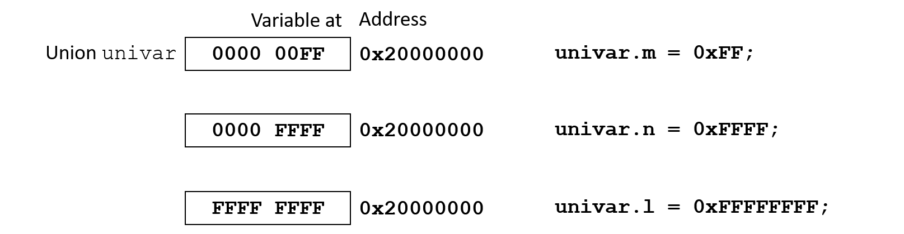

# Unions

What are unions?

> Unions are similar to structures but a union’s members all share the same memory location. In essence a union is a variable that is capable of holding different types of data at different times.

Unions:
- may contain any number of members which may be of any data type.
- are as large as their largest member.
- use exactly the same syntax as structures except `struct` is replaced with `union`.

**Syntax**
```c
union unionName {
    type1 memberName1;
    ...
    typen memberNamen;
}
```

**Code example**
```c
union mixedPickles {
    char c;
    int i;
    float f;
}
```

## Purpose of unions

A `union` allows the same memory location to be used for different data types. The amount of memory that is allocated for the union is determined by its largest member. This saves space, especially for large structures where the programmer can be sure that the same members never occur at the same time.

## Creating unions with typedefs

**Syntax**
```c
typedef union unionTag {
    type1 memberName1;
    ...
    typen memberNamen;
} typeName;
```

**Code example**
```c
// Union type to access the Application Program Status Register (APSR).
typedef union
{
  struct
  {
    uint32_t _reserved0:27;    // bit:  0..26  Reserved
    uint32_t Q:1;              // bit:     27  Saturation condition flag
    uint32_t V:1;              // bit:     28  Overflow condition code flag
    uint32_t C:1;              // bit:     29  Carry condition code flag
    uint32_t Z:1;              // bit:     30  Zero condition code flag
    uint32_t N:1;              // bit:     31  Negative condition code flag
  } b;                         // Structure used for bit  access
  uint32_t w;                  // Type      used for word access
} APSR_Type;
```

## Unions in memory

Union variables may be declared exactly like structure variables. The big difference is that only memory is allocated to accommodate the union’s largest member. For a structure, memory is allocated to accommodate for the whole structure.

**Code example**
```c
typedef union {
    uint8_t m;
    uint16_t n;
    uint32_t l;
} myUnion;

myUnion univar;
```



## Unions vs. structures

Unions allow viewing and manipulating the same memory location using different data types. Structures enable the grouping of multiple data types and while accessing them individually.
